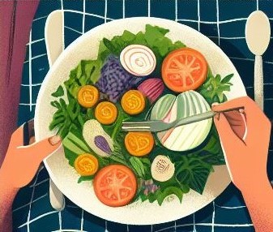
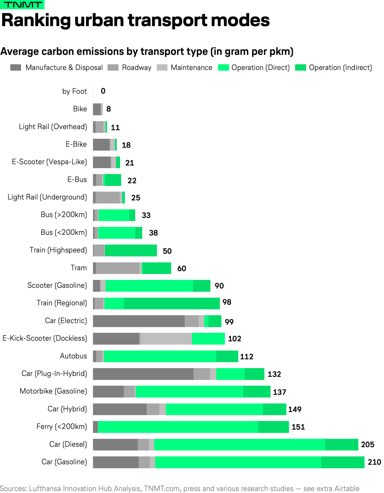

# Embracing a Greener Lifestyle: Simple and Sustainable Choices

* [Introduction](#introduction)
* [What is Green Living?](#what-is-green-living)
  * [1. Reduce, Reuse, Recycle](#1-reduce-reuse-recycle)
  * [2. Sustainable Transportation](#2-sustainable-transportation)
  * [3. Eco-Friendly Eating](#3-eco-friendly-eating)
  * [4. Energy Conservation](#4-energy-conservation)
  * [5. Green Spaces and Gardening](#5-green-spaces-and-gardening)
  * [6. Conscious Consumption](#6-conscious-consumption)
  * [7. Environmental Education and Advocacy](#7-environmental-education-and-advocacy)
  * [8. Reduce Food Waste](#8-reduce-food-waste)
  * [9. Biodegradable Household Products](#9-biodegradable-household-products)
  * [10. Water Conservation](#10-water-conservation)
  * [11. Eco-Driving](#11-eco-driving)
  * [12. Eat Less Meat](#12-eat-less-meat)
  * [13. Volunteering](#13-volunteering)
  * [14. Green Building Practices](#14-green-building-practices)
  * [15. Shop local and buy sustainable](#15-shop-local-and-buy-sustainable)
  * [16. Sustainable Shopping Habits](#16-sustainable-shopping-habits)
  * [17. Organic Farming and Local Sourcing](#17-organic-farming-and-local-sourcing)
  * [18. Sustainability For Pet-Owners](#18-sustainability--for-pet-owners)
  * [19. Minimalism](#19-minimalism)
* [What are the benefits of Green Living?](#what-are-the-benefits-of-green-living)
* [Why is it hard for people to adopt greener habits?](#why-is-it-hard-for-people-to-adopt-greener-habits)
* [Budget-Friendly Tips for Green Living](#budget-friendly-tips-for-green-living)
* [Adopting a Greener Lifestyle for Visual Learners!](#adopting-a-greener-lifestyle-for-visual-learners)
* [Specific examples of Green Living](#specific-examples-of-green-living)
* [Ready for a Scandal?](#ready-for-a-scandal)
* [The Electric Car Myth](#The-Electric-Car-Myth)
* [References](#references)

# Introduction

Welcome to our _Green Living Guide!_ This document outlines sustainable practices you can adopt in order to minimize your environmental impact and promote a healthier planet.

  

# What is Green Living?

**Green Living** is a way of sustainable habits so that they work alongside the resources of nature instead of destroying them. It reduces one's environmental impact by involving choices that minimize harm to the environment.

Living a greener lifestyle not only benefits the environment but also contributes to personal well-being and the health of future generations. Whether you're passionate about conservation, reducing waste, or simply want to make a positive impact, there are plenty of interesting and fulfilling ways to adopt eco-friendly practices into your daily routine.

  

## 1. Reduce, Reuse, Recycle

Embrace the mantra of "reduce, reuse, recycle" to minimize waste and conserve resources. Opt for reusable products such as water bottles, shopping bags, and containers, and recycle materials like paper, plastic, glass, and metal whenever possible. Consider upcycling old items into new creations or donating unwanted items to charity instead of throwing them away.

  

## 2. Sustainable Transportation

Reduce your carbon footprint by opting for eco-friendly modes of transportation. Walk, bike, carpool, or use public transportation instead of driving alone. Consider investing in electric vehicles or hybrid cars for a more sustainable commute. Plan your trips efficiently and combine errands to minimize unnecessary driving.

  

## 3. Eco-Friendly Eating

Make conscious choices about what you eat and where it comes from. Support local farmers and markets to reduce the carbon footprint associated with food transportation. Choose organic and seasonal produce whenever possible, and reduce meat consumption to lower your environmental impact. Explore plant-based alternatives and incorporate more sustainable seafood options into your diet.

  

## 4. Energy Conservation

Save energy and reduce emissions by adopting energy-efficient practices at home and work. Switch to LED light bulbs, unplug electronics when not in use, use programmable thermostats to regulate heating and cooling, and invest in renewable energy sources such as solar panels or wind turbines. Consider energy audits to identify areas where you can improve efficiency and reduce consumption.

  

## 5. Green Spaces and Gardening

Connect with nature by cultivating green spaces in your home or community. Plant trees, flowers, and native vegetation to promote biodiversity and provide habitats for wildlife. Start a garden to grow your own fruits, vegetables, and herbs, and compost organic waste to enrich the soil naturally. Create a sustainable garden design that conserves water, reduces chemical use, and attracts beneficial pollinators.

  

## 6. Conscious Consumption

Practice mindful consumerism by making informed choices about the products you buy. Support eco-friendly and ethical brands that prioritize sustainability, fair trade, and ethical labor practices. Consider repairing, repurposing, or upcycling items instead of buying new ones. Reduce packaging waste by choosing products with minimal packaging or opting for package-free alternatives.

## 7. Environmental Education and Advocacy

Stay informed about environmental issues and take action to advocate for positive change. Educate yourself and others about the importance of conservation, climate action, and environmental justice. Get involved in local community initiatives, volunteer for environmental organizations, and participate in advocacy campaigns. Use your voice to urge policymakers and businesses to adopt sustainable practices and policies that protect the planet for future generations.

  

## 8. Reduce Food Waste

Only in the U.S., 30%-40% of the food supply ends up as a waste! The largest category of wasted items ends up in landfills, according to the <a href="https://www.fda.gov/food/consumers/food-loss-and-waste"> U.S. Food & Drug Administration </a>. That is terrible for the environment, since rotting food produces methane that contributes to climate change, but also a lost opportunity to feed those in need. To help reduce food waste you could try to limit shopping for only what you need. You can also try composting. Composting can be done by building your own compost bin, dropping off waste at a designated collection site, or participating in your city or town’s program.

  

## 9. Biodegradable Household Products

To limit the impact of non-recyclable products' waste, you can choose to purchase items made of non-synthetic ingredients that are biodegradable. Biodegradable products dissolve due to contact with bacteria and fungi. So, when they come into contact with nature, they will dissolve quickly through a natural process and won't cause any harm. These products could be: recycled toilet paper, natural ingredient shampoo, natural deodorant, bamboo toothbrush and hairbrush, biodegradable shopping bags, or washcloths made from hemp or agave fibres.

## 10. Water Conservation

Practice conscientious water management by promptly repairing any leaks, investing in water-efficient appliances, shortening shower durations, and being mindful to turn off the faucet while shampooing or brushing your teeth. These seemingly minor adjustments in our daily water usage habits can collectively make a substantial impact on conservation efforts.

## 11. Eco-Driving

Eco-driving, as proven by the <a href="https://www.racfoundation.org/"> RAC Foundation </a>, leads to safer, cleaner and more affordable journeys. Fuel efficiency can be improved by as much as 10% via regular vehicle maintenance. This maintenance should include checking tyre pressure (since tyres underinflated by a quarter can cause a 2% increase in fuel consumption), as well as removing unused roof racks and anything that adds unnecessary weight (since every additional 45 kg reduces fuel economy by 2%). If the used speed is less than 40mph, it is more fuel-efficient to avoid using air conditioning and prefer opening a window. Furthermore, when stuck in wait times of one minute or more, engines should be turned off. Lastly, sharp acceleration and heavy braking should be widely avoided, given that aggressive driving can significantly raise fuel consumption.

## 12. Eat Less Meat

In the agriculture industry most GHG emissions come from meat. Farming releases two quite harmful greenhouse gases: methane from livestock during digestion and nitrous oxide, an indirect product of organic and mineral nitrogen fertilizers. All emissions occur through the stages of production, processing, packaging, and delivery, with the highest emissions coming from producing and preparing meat. So, less meat means less GHG emissions! That doesn't mean that everybody should make drastic changes like being vegetarian or vegan, simply reducing meat intake can already have a big impact.

  

## 13. Volunteering

Engage in environmental volunteering that resonates with your passions and principles. Explore a plethora of organizations and endeavors committed to conserving the environment and fostering sustainability. Seek out local initiatives concentrating on diverse activities such as planting trees, tidying beaches, safeguarding wildlife, or lobbying for policy reforms. Through volunteering, you not only directly contribute to environmental causes but also embark on a journey of personal enrichment, honing skills, and forging connections with fellow advocates who share your vision.

## 14. Green Building Practices

Prioritize energy-efficient construction designs, such as passive solar methods, high-performance windows and other smart functionalities in building architecture, in order to maintain green practices. Incorporate special house equipment, like wind moderators and heating devices, in order to reduce the reliance on fossil fuels and environmental-burdening sources. With the inclusion of these practices, not only do the green buildings decrease pollution but also establish comfortable living conditions.

  

## 15. Shop local and buy sustainable

To minimize the carbon footprint of your food consumption, opt for locally sourced and seasonal produce. By doing so, you not only support small-scale businesses and farms in your vicinity but also diminish the greenhouse gas emissions linked to transportation and refrigeration. Sustainable agriculture practices, which utilize up to 56 percent less energy and generate 64 percent fewer emissions compared to conventional methods, foster greater biodiversity. Take your eco-friendly efforts a step further by cultivating your own fruits, vegetables, and herbs. Whether in a garden, on a balcony, or even a window sill, you can embark on home gardening ventures. Consider initiating a community garden project in your area to engage and inspire others to join in the sustainability movement.

## 16. Sustainable Shopping Habits

Embracing sustainable shopping practices is pivotal for those committed to an eco-conscious lifestyle, as it plays a vital role in minimizing our environmental impact. Below are some valuable pointers to guide ethical and green shopping decisions:

1.Sustainable Shopping: Opt for products crafted from natural materials such as organic cotton or bamboo, consider purchasing secondhand items when feasible, and seek out products packaged with minimal or biodegradable materials.

2.Ethical Shopping: Support companies committed to fair labor practices, producing high-quality goods with minimal waste generation, and emphasizing sustainability as a priority over maximizing profit margins.

3.Green Shopping: Prioritize locally sourced goods over imported alternatives, minimize the use of single-use plastics whenever feasible, choose refillable containers over disposable ones, and invest in energy-efficient appliances to reduce environmental impact

## 17. Organic Farming and Local Sourcing

**Organic Farming**: When you choose organic produce, you’re supporting farming practices that prioritize soil health, biodiversity, and natural pest control. Organic farmers avoid synthetic pesticides and fertilizers, which can harm both the environment and human health. By opting for organic fruits, vegetables, and grains, you reduce your exposure to harmful chemicals and promote a healthier ecosystem.

**Local Sourcing**: Purchasing locally grown food has several benefits. First, it reduces the carbon footprint associated with transportation.The shorter the food chain, the less waste created before it reaches your kitchen.Locally-sourced produce travels about 27 times less distance than conventionally sourced produce [9]. When food doesn't travel long distances, fewer greenhouse gases are emitted. Second, buying local supports small-scale farmers and strengthens the local economy. Additionally, local produce is often fresher and tastier because it doesn't spend days or weeks in transit.

By choosing organic and local products, you actively participate in a more sustainable food system—one that nourishes both people and the planet. Let’s make conscious choices that have a positive impact on our environment and well-being .

  

## 18. Sustainability  For Pet-Owners
Embrace a greener lifestyle by selecting environmentally conscious pet toys. Ditch the plastic and opt for eco-friendly dog toys crafted from natural materials such as rice husk, rubber, and hemp, or consider those ingeniously made from recycled materials like old t-shirts. Also, Shop for sustainable dog food and eco-friendly cat food. Choosing sustainable pet food options can significantly decrease the carbon footprint linked with pet food production, which currently contributes to approximately 106 million tons of CO2 emissions [10].

## 19. Minimalism

Minimalism embodies a mindset that advocates for living a simpler, more intentional life. It revolves around the notion of prioritizing quality over quantity, where the focus lies on what truly enhances our well-being and purpose. This lifestyle emphasizes the deliberate reduction of unnecessary possessions, distractions, and clutter, aiming to create space for what truly matters.

Following there are some practical tips to adopt a minimalist lifestyle:

1. **Use it or lose it**
2. **One in, one out**
3. **Declutter first, organize afterward**
4. **Wait before buying non-essentials**
5. **Don’t keep things that bring up negative memories**
6. **Declutter your entire home at the end of each season**
7. **Shop with a list and stick to it**
8. **The 50% rule**
9. **If it’s not a “hell yes”, it’s a “no”**
10. **Don’t keep duplicates**
11. **Give everything a home**
12. **Only keep things you love**
13. **If it can be digitized, don’t keep the physical copy**
14. **The 20/20 rule**

# What are the benefits of Green Living?
* Make a difference in pollution by following the above habits.
* Products on market become cheaper.
* Connection with like-minded individuals.
* Improvement of physical and mental health. 

# Why is it hard for people to adopt greener habits?

* Lack of Awareness
* Cost
* Convenience
* Habits
* Social Environment
* Time constraints

> Though adopting greener habits is not an easy task, we should always strive to make even the smallest of changes. Remember *something* is better than nothing!

# Budget-Friendly Tips for Green Living

1. **Energy Efficiency Upgrades:** Replace bulbs with LED lights, unplug electronics when not in use, and weatherproof doors and windows.

2. **DIY Cleaning Products:** Make eco-friendly cleaners using vinegar, baking soda, and lemon.

3. **Thrift Shopping and Swapping:** Explore thrift stores and online swapping platforms for affordable, sustainable items.

4. **Public Transportation and Carpooling:** Opt for public transit, biking, or carpooling to save on fuel and emissions.

5. **Upcycling and Repurposing:** Transform old items into new ones through creative upcycling projects.

6. **Unplug and Conserve Water:** Fix leaks, take shorter showers, and collect rainwater for watering plants.

7. **Second-Hand and Refurbished Electronics:** Purchase second-hand or refurbished electronics instead of buying new ones to save money and extend the lifespan of products.

# Adopting a Greener Lifestyle for Visual Learners!

Are you a visual learner? [Here](https://www.youtube.com/watch?v=kZIrIQDf1nQ) is a short video explaining how you can adopt a greener lifestyle by just switching out a few things or doing a few small tasks each day!

# Specific examples of Green Living
| **Transportation**                                        | **Diet**                                   | **Water**                                   |
|-----------------------------------------------------------|--------------------------------------------|---------------------------------------------|
| Walking, biking, or using public transportation           | Cultivating a garden with native plants    | Fixing leaks in plumbing fixtures and pipes |
| Switching to an electric car                              | Choosing locally sourced and organic foods | Collecting rainwater for watering plants.   |
| Ride-sharing to reduce the number of vehicles in the road | Reducing meat consumption                  | Installing low-flow showerheads             |

# Ready for a Scandal?

We are no strangers to fast fashion due to the variety of industries that mass produce clothes to accommodate the growing needs of our generations. 

*But is that really helpful for the environment?*

Surely, not! And that is the case with the Shein Industry. You have probably heard of it, as it became very popular through TikTok, the famous application of short videos and exciting content. 

Shein is a brand that mass produces clothes and distributes them internationally and at a very cheap price. It has faced many allegations over the years regarding the insufferable working conditions it creates for its employees, the inadequate pay and many more other huge issues including *- but not limited to -* copying designers and extremely low quality of the materials used in production. 

The most important aspect to take away from the Shein scandal is the environmental damages that this brand produces daily. Making so many clothes in such little time is not as wonderful as it may seem at first glance. Some problems that Shein actively contributes to are excessive resource consumption, waste generation, and pollution - such dangerous problems that create critical life conditions for our world!

  

I hope this is a reminder for you to stop helping huge, manipulative industries to thrive and, instead, invest in cute, vintage stores *(they are very in fashion right now!)* and buy second-hand as much as you can. 

> **One man's trash is another man's treasure!**

# The Electric Car Myth

Its widely supported that the solution to all our transport sustainability goals is the electrification of personal passenger cars. Many outlets support this clause and pursue a future where every car is switched from gas to electric, and we all live happily ever after. This goal which is widely regarded as fact if completely baseless. Electric cars when taking into account other environmental impacts (such as Manufacturing & Disposal, Roadway Creation, and Maintenance) and not just their operative emissions (which for electric mobility are essentially zero if powered by renewables sources) a really different picture is painted. Electric cars cannot beat a single mode of land based public transit (powered by electricity or not) in the carbon emissions equivalence per passenger per kilometer[14]. We have the means today to meet our emissions goals (public transit) but the only solution pushed is electric cars. That’s not to say that gas guzzling cars should not be replaces by electric ones; but with an average urban load capacity of 1.3 passengers per steel death trap (car)[15] maybe it's time to push for the adoption of urban public transit as the real solution to the new greener world.

  

## References 
1. [AMC Staff. (Retrieved March 29, 2024). Go Green: 10 Tips for a More Sustainable Lifestyle. AMC Outdoors.](https://www.outdoors.org/resources/amc-outdoors/conservation-and-climate/go-green-10-tips-for-a-more-sustainable-lifestyle/)
2. [Berrill, A., Card, N., et al. (2020, February 29). 50 simple ways to make your life greener. The Guardian.](https://www.theguardian.com/environment/2020/feb/29/50-ways-to-green-up-your-life-save-the-planet)
3. [Hummert, N. (Retrieved November 23, 2023). Embracing Sustainability: A Guide To Encouraging A Greener Lifestyle.](https://equilibrium-lifestyle.co.uk/embracing-sustainability-a-guide-to-encouraging-a-greener-lifestyle/)
4. [Nandu, J. (Retrieved June 3, 2023). 10 Simple Steps to Embrace a Greener Lifestyle Today.](https://www.linkedin.com/pulse/10-simple-steps-embrace-greener-lifestyle-today-jay-nandu/)
5. [Safdie, S. (2023, August 9). What is green living? Greenly. Retrieved March 28, 2024.](https://greenly.earth/en-us/blog/company-guide/what-is-green-living)
6. [Wark, C. (2024, March 28). 40 Ways to Be More Eco Friendly in 2024.](https://www.greenmatch.co.uk/blog/how-to-be-more-eco-friendly)
7. [Environment programme (2022, May 04). 10 ways you can help fight the climate crisis.](https://www.unep.org/news-and-stories/story/10-ways-you-can-help-fight-climate-crisis)
8. [ (2023, March 23). Transform Your Life: The Ultimate Guide to Sustainable Lifestyle.](https://greenliving.guru/sustainable-lifestyle/)
9. [Farmers Markets promote sustainability, Farmers Market Coalition (accessed Mar. 30, 2024).](https://farmersmarketcoalition.org/education/farmers-markets-promote-sustainability/)
10. [H. Carrillo, 101 Sustainability Tips & Ideas for a greener lifestyle, Sustainable Jungle (accessed Mar. 30, 2024).](https://www.sustainablejungle.com/sustainable-living/sustainability-tips/) 
11. [Sustainability in everyday life | Sustainability by ACCIONA](https://www.youtube.com/watch?v=kZIrIQDf1nQ)
12. [Ready for a Scandal? | Image from the web](https://richardsonbay.audubon.org/sites/default/files/styles/article_hero_inline/public/fast_fashion_trash_0.jpeg?itok=k51OT4Sw)
13. [The Washington Post, 2023. The scandals of Shein's fast-fashion empire.](https://www.washingtonpost.com/podcasts/post-reports/the-scandals-of-sheins-fastfashion-empire/)
14. [The environmental impact of today’s transport types, TNMT.](https://tnmt.com/infographics/carbon-emissions-by-transport-type/)
15. [European Environment Agency, “ Paving the way for EU enlargement - Indicators of transport and environment integration,” Nov. 2002.](https://www.eea.europa.eu/publications/environmental_issue_report_2002_24)
16. [ASTOUL, E. (2024,March 19). 14 LIFE-CHANGING MINIMALIST RULES TO LIVE BY](https://greenwithless.com/minimalist-rules-to-live-by/)