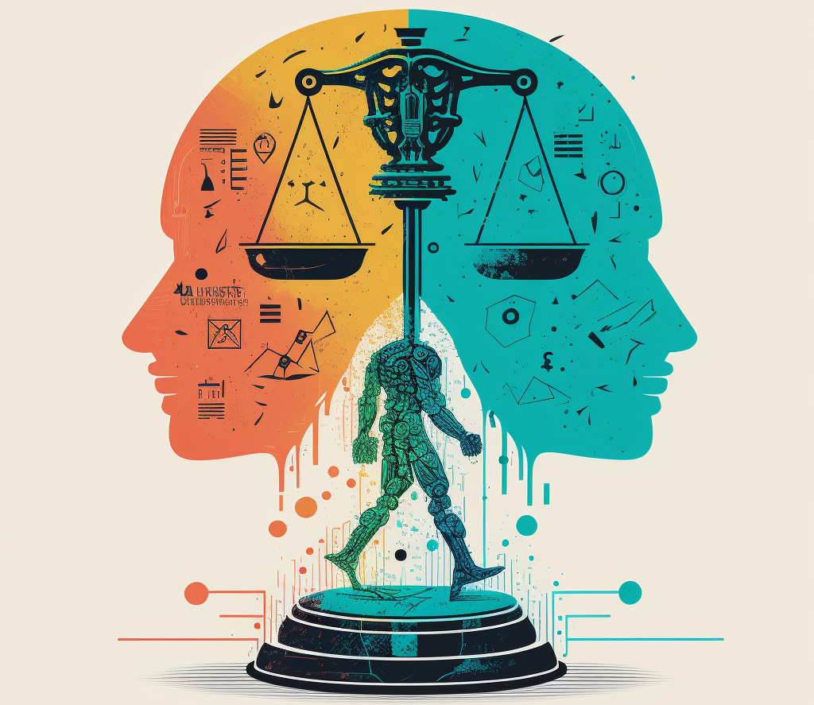
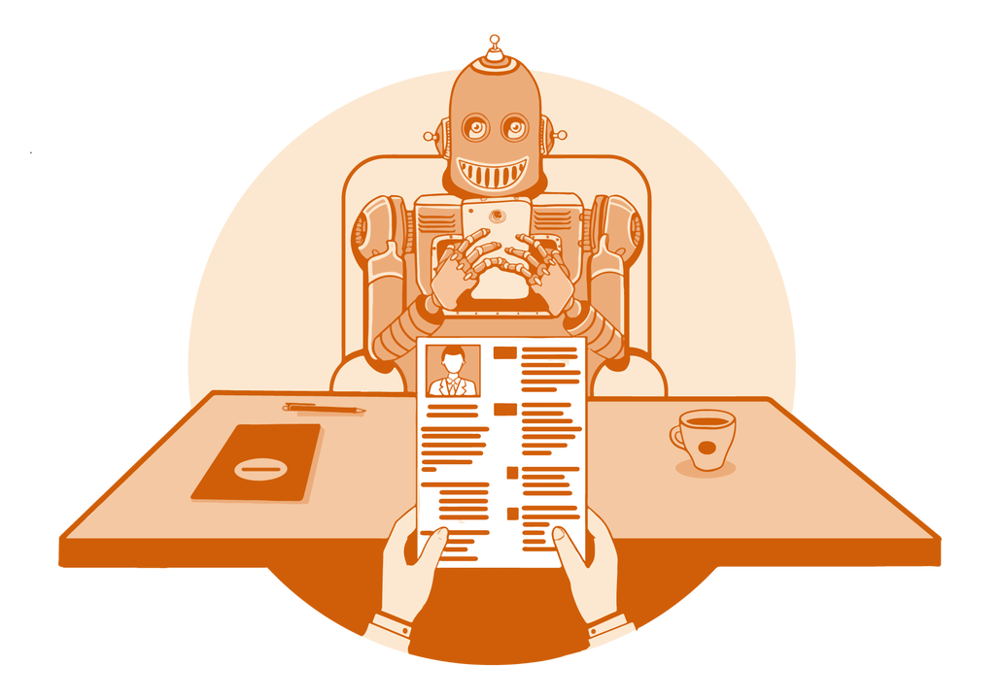
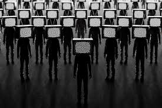
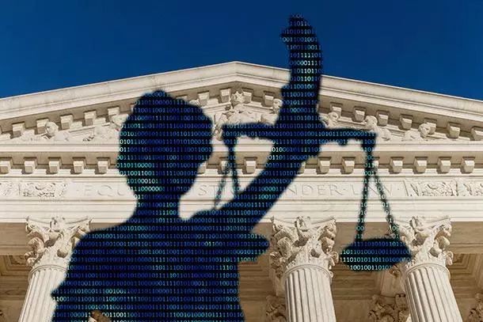
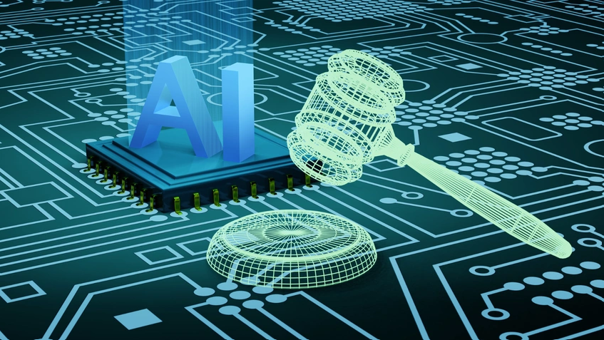
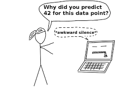
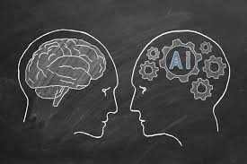
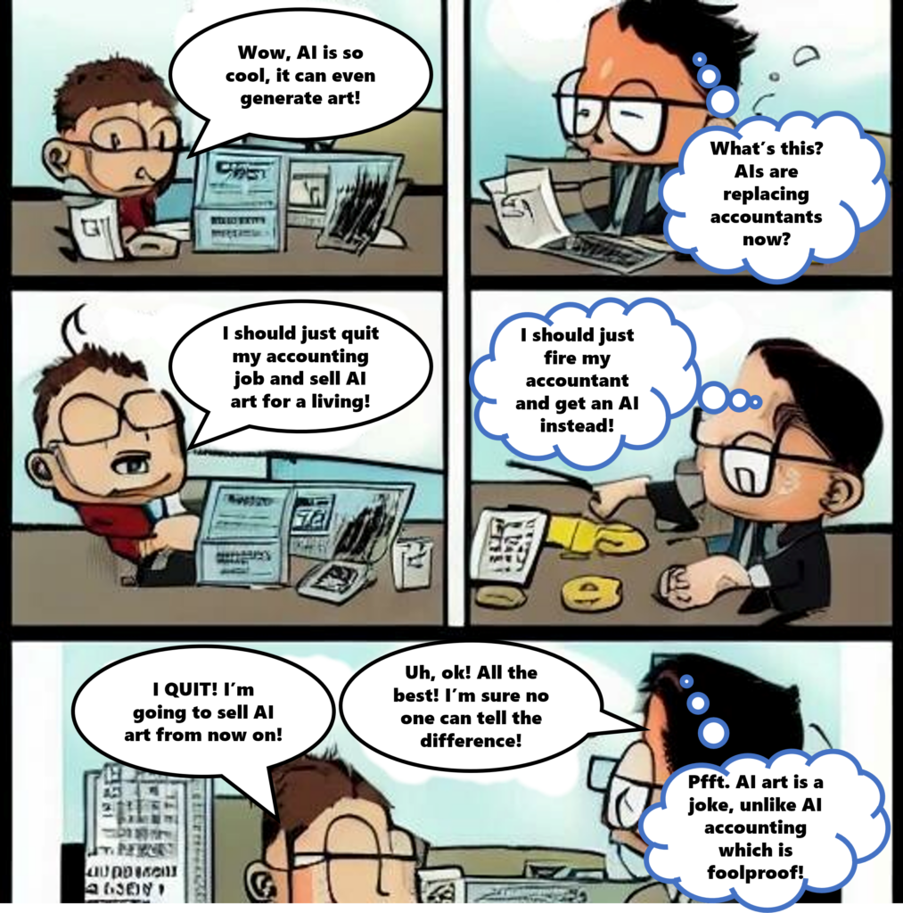

# AI and Ethics

Artificial Intelligence (AI) has the potential to revolutionize various aspects of society. However, alongside its potential benefits, AI also brings forth a host of ethical concerns that must be carefully addressed to ensure responsible development and deployment.

- [Introduction](#introduction)
- [Why do we use AI?](#why-do-we-use-ai)
- [Ethical Concerns](#ethical-concerns)
  - [Bias and Fairness](#bias-and-fairness)
  - [Privacy](#privacy)
  - [Accountability and Transparency](#accountability-and-transparency)
  - [Job Displacement](#job-displacement)
  - [Autonomous Weapons](#autonomous-weapons)
  - [Algorithmic Transparency](#algorithmic-transparency)
  - [Data Modification](#data-modification)
  - [Environmental Impact](#environmental-impact)
  - [Security](#security)
  - [Cultural and Social Impact](#cultural-and-social-impact) 
  - [Responsibility](#responsibility) 
  - [Misinformation](#misinformation)
  - [AI in Mental Health Care](#ai-in-mental-health-care)
  - [AI in Education](#ai-in-education)
  - [Social Governance](#social-governance)
  - [AI in the Court of Law](#ai-in-the-court-of-law)
  - [Creativity and Ownership](#creativity-and-ownership)
  - [AI in Media](#ai-in-media)
  - [AI in Marketing](#ai-in-marketing)
- [Controversial Usage of AI](#controversial-usage-of-ai)
  - [Examples](#examples-of-controversial-ai)
- [Recommendation on the Ethics of Artificial Intelligence](#recommendation-on-the-ethics-of-artificial-intelligence)
  - [Policy Action Areas](#policy-action-areas)
- [Ethical Principles for AI Development](#ethical-principles-for-ai-development)
  - [Fairness and Equity](#fairness-and-equity)
  - [Privacy and Data Protection](#privacy-and-data-protection)
  - [Transparency and Explainability](#transparency-and-explainability)
  - [Accountability](#accountability)
  - [Societal Impact](#societal-impact)
  - [Interpretability](#interpretability)
  - [Human agency and oversight](#human-agency-and-oversight)
  - [Technical robustness and safety](#technical-robustness-and-safety)
  - [Social and environmental well-being](#social-and-environmental-well-being)
  - [Dealing with responsibility](#dealing-with-responsibility)
  - [Resilience and Continuity](#resilience-and-continuity)
  - [Contestability](#contestability)
  - [Inclusivity](#inclusivity)
  - [Equitable Access](#equitable-access)
- [Can AI Help Us In Making This World More Ethical?](#can-ai-help-us-in-making-this-world-more-ethical)
- [A Guide to AI](#a-guide-to-ai)
- [Courses on AI and Ethics](#courses-on-ai-and-ethics)
  - [Online courses](#online-courses)
    -[Free courses](#free)
    -[Paid courses](#paid)
  - [Masters Degrees](#masters-degrees)
- [AI Jokes](#ai-jokes)
- [References](#references)

  

*Icon made by SwissCognitive from [https://swisscognitive.ch](https://swisscognitive.ch/2023/04/19/ai-ethics-in-focus-balancing-innovation-security-and-responsibility-swisscognitive-ai-radar/)*

## Introduction
This document focuses on **AI and Ethics**, a set of guiding principles that are used to ensure the responsible use of AI. Although the goal is a secure, safe and humane approach, this has been questioned by a lot of people causing various ethical concerns.

## Why do we use AI?
AI represents a thrilling expansion of numerous human abilities, encompassing observation, processing, and decision-making. Its outputs and impacts are virtually instantaneous, providing unprecedented efficiencies previously unimaginable. Leveraging computing power and sophisticated systems, AI technologies surpass human cognitive capacities, enabling continuous "machine learning" autonomously and recognizing intricate patterns beyond human perception (e.g., identifying individuals by their gait alone). Additionally, AI employs dynamic nudging to promptly incentivize compliance, exemplified in commercial settings by tailored benefit selections aimed at stimulating particular economic behaviors among customers.

## Ethical Concerns
In March 2023, more than 1,000 experts, including technology leaders like Elon Musk and Apple co-founder Steve Wozniak, signed an open letter urging a six-month pause in the development of new artificial intelligence (AI) systems. The letter emphasized the potential risks posed by AI experiments that are advancing rapidly and becoming increasingly powerful. The experts called for a halt to the creation of AI models beyond the capabilities of the most advanced publicly available system, GPT-4, developed by OpenAI. During this pause, researchers and AI labs should focus on creating new principles for designing AI systems that prioritize safety, transparency, and trustworthiness. Of course, this pivotal pause, advocated by experts across the globe, underscores the critical importance of ethical considerations in the ever-evolving world of artificial intelligence. 

### Bias and Fairness
AI systems often learn from historical data, which may contain biases reflecting societal inequalities. If not addressed, these biases can perpetuate discrimination and unfairness, affecting individuals' opportunities and rights.

In some fields, like healthcare, using AI algorithms that don't take into account the experiences of women and minority groups can lead to wrong results for those specific communities. Also, when companies use applicant tracking systems that analyze language, it can create biases that favor some candidates over others, based on the wording used in their resumes. 

  

*Image taken from [www.playhunt.io](https://playhunt.io/nl/for-candidates/artificial-intelligence-resume-screening)*

For example, Amazon stopped using a hiring algorithm because it was biased towards male applicants. The algorithm favored certain terms like "executed" or "captured," which were more common in men's resumes.

- **Bias in Data Sets**:
 Another problem regarding bias is found in data sets used to train AI tools. That can be presented in cases for which the system has not been specifically trained for. A good example of the problem created is an AI system that is trained to classify text as English or German, if the tool was posed with a piece of text in a different language like French, it would still try to generate an answer. This can easily lead to "hidden" misinformation or mispredictions in the usage of AI.
 A similar concern is presented with facial recognition data sets that do not include a diversity in ethnic groups, issues like this one can cause trained AI models to display inaccuracies across different races.

### Privacy
The vast amounts of data required for AI applications raise concerns about privacy. Unauthorized access to personal data or its misuse can lead to breaches of privacy and surveillance issues, undermining individuals' autonomy and rights.

- **Surveillance**:
	The use of AI models to monitor humans for purposes such as security and marketing. The latter can easily resolve to problems regarding abuse of power by some individuals that may even use the technology for political reasons based on their beliefs or affiliations.

- **Consent**:
  The question whether a user can give informed consent in a system that he himself may not understand. This category falls under the premise that users, when interacting with online content, make a choice regarding the share of their data. But can they make the same choice when they dont know the insides of the AI models used by the private company/ organization?

  

*Icon made by deemakdaksina from [www.flaticon.com](https://www.flaticon.com/)*

### Accountability and Transparency
The opacity of AI decision-making processes poses challenges for accountability. It can be difficult to understand how and why AI systems make decisions, making it challenging to assign responsibility in case of errors or harm. Ensuring transparency and explainability in AI algorithms is crucial for accountability and trust.

  

*Icon made by Witchai.wi from [www.flaticon.com](https://www.flaticon.com/)*

### Job Displacement
Automation driven by AI has the potential to disrupt labor markets, leading to job displacement. This raises ethical questions about ensuring the welfare and retraining of displaced workers, as well as addressing potential economic inequalities arising from AI-driven automation.

  

*Icon made by Freepik from [www.flaticon.com](https://www.flaticon.com/)*

### Autonomous Weapons
The development of autonomous weapons powered by AI raises serious ethical questions about the delegation of lethal decision-making to machines. Concerns include the potential for unintended consequences, civilian harm, and the erosion of moral responsibility in warfare.

### Algorithmic Transparency
The frequent lack of transparency in algorithmic design, creates major concerns when it comes to the interests and the motives of the creators. The development of AI by various companies often contains the danger of system manipulation, in order to address external motives. This could potentially lead to incidents of discrimination, or inability to mitigate bias.

  

*Icon made by Eucalyp from [www.flaticon.com](https://www.flaticon.com/)*

### Data Modification
After the data fitting process, modifying or removing data in the training set can be a very complex request. An organization that discovers its model was trained on inaccurate data may face substantial repercussions that can be hard to undo.

  

*Icon made by monkik from [www.flaticon.com](https://www.flaticon.com/)*

### Environmental Impact
Training AI models requires immense amounts of resources and significant computational power. The process leads to vast energy consumption and burning of fossil fuels. Subsequently, the carbon emissions result in significant environmental pollution, making the deployment of the models a resource-intensive procedure.

  

*Icon made by juicy_fish from [www.flaticon.com](https://www.flaticon.com/)*

### Security
AI systems can be vulnerable to attacks such as data poisoning, adversarial attacks, and model stealing. Ensuring robust cybersecurity measures is crucial to prevent malicious actors from exploiting AI systems for their gain, which can have wide-ranging consequences on privacy, safety, and trust.

In addition to these risks, people are becoming more aware of weaknesses that exist within AI systems themselves. These weaknesses aren't just about typical online threats but also include new ways that attackers can target AI models directly. For instance, they might try to change how the AI learns by messing with the data it uses, which could lead to models that aren't safe or don't work correctly. Also, because we don't have good tools for spotting threats to AI systems, it's even harder to trust the decisions these systems make.

  

*Icon made by Freepik from [www.flaticon.com](https://www.flaticon.com/)*

### Cultural and Social Impact
The deployment of AI systems can have significant cultural and social implications, impacting norms, values, and human interactions. Issues such as cultural biases in AI, representation in datasets, and the effects of AI-driven decisions on marginalized communities need to be addressed to promote inclusivity and fairness.

  

*Icon made by Flat Icons from [www.flaticon.com](https://www.flaticon.com/)*

### Responsibility

The concern about **responsibility** related to AI systems, refers to the issue of who is really accountable when AI machines take decisions in the healthcare domain. When an error occurs, it is difficult or almost impossible, to define to what extent the human clinicians can be held accountable for patient harm. Another variable in the function is the role of AI developers and how much would they also be affected if a serious damage is caused by their work. 

  

*Icon made by Flat Icons from [www.flaticon.com](https://www.flaticon.com/)*  
*Responsibility icons created by Sir.Vector - Flaticon*

### AI in Mental Health Care

One concern is the risk of bias in AI algorithms, as they rely on biased data, leading to unequal treatment of patients and perpetuating healthcare disparities. Another issue is the need for accountability and transparency in AI-driven mental health diagnoses, ensuring clinicians understand the limitations and biases in AI diagnoses. Privacy and confidentiality are major worries, as AI systems process sensitive personal information, raising the risk of unauthorized access or misuse. Lastly, integrating AI into psychiatric practice raises ethical questions about automating care and its impact on the therapeutic relationship between patients and providers.

  

### AI in Education
AI's impact on the education sector is profound. While it provides numerous benefits by aiding in academic and administrative tasks, concerns regarding its potential to diminish decision-making abilities, foster laziness, and compromise security cannot be overlooked. Studies indicate that integrating AI into education exacerbates the decline in human decision-making skills and promotes user passivity through task automation. Before implementing AI technology in education, it's crucial to take significant measures. Adopting AI without addressing major human concerns it's like asking for trouble. It's recommended to focus on justified design, deployment, and utilization of AI in education to effectively address these problems.

  

### Social Governance
More and more countries and governments are interested in using Artificial Intelligence in order to better rule their countries. Focusing on the example 
of Greece, on October of 2023 an Advisory Committee on issues related to Artificial Intelligence issues was establlished headed by Professor Konstantinos Daskalakis. The Committee will provide evidence-based advice and proposals on how Greece can take advantage of the multiple possibilities and opportunities arising from the use of Artificial Intelligence. Moreover, its goal is to offer enhancements on the economy and society, improve productivity, increase innovation, strengthen infrastructure, better manage the effects of the climate crisis, support human resources and social cohesion, create quality jobs, defend national digital sovereignty and improve the operation of the country.

  

### Misinformation

The dissemination of misinformation has the unfortunate effect of deepening social rifts and perpetuating false beliefs, to the detriment of both institutions and individuals. Particularly notable amidst recent political turbulence, misinformation has the potential to sway public sentiment and inflict significant harm on reputations. Once misinformation proliferates across social media platforms, tracing its origins becomes arduous, and countering its spread becomes an uphill battle. AI tools have even been harnessed to amplify misinformation, camouflaging it as credible information, further complicating efforts to combat its influence.

  

### AI in the Court of Law
Presumably, if judiciary systems use AI, cases could be evaluated and justice could be applied in a better, faster, and more efficient way. AI methods can potentially have a huge impact in many areas, from the legal professions and the judiciary to aiding the decision-making of legislative and administrative public bodies. Lawyer efficiency and accuracy can be increased in both counselling and litigation and existing software systems for judges can be complemented and enhanced through AI tools in order to support them in drafting new decisions. It is argued that AI could help create a fairer criminal judicial system by making informed decisions devoid of any bias and subjectivity. However, there are many ethical challenges. Firstly, there is the lack of transparency of AI tools. Then, there is the possibility that AI decisions are susceptible to inaccuracies, discriminatory outcomes, embedded or inserted bias. And, lastly, there are many concerns for fairness and risk for Human Rights and other fundamental values.

  

### Creativity and Ownership
As we all know, AI has the ability to generate art. That specific type of artwork, though, requires a new definition of what it means to be an “author”, in order to do justice to the creative work of both the “original” author and the algorithms and technologies that produced the work of art itself. Given that AI is a powerful tool for creation, it raises important questions about the future of art, the rights of artists and the integrity of the creative value chain. Frameworks need to be developed to differentiate piracy and plagiarism from originality and creativity, and to recognize the value of human creative work in our interactions with AI. These frameworks pose a need to avoid the deliberate exploitation of the work and creativity of human beings, and to ensure adequate remuneration and recognition for artists, the integrity of the cultural value chain, and the cultural sector’s ability to provide vocational rehabilitation.

  

### AI in Media
AI has a big impact on modern societies when utilized to create fake media. More specifically, AI can be used to fabricate content harming to a certain person or a group of people by creating deepfakes. The manipulation of voice images and video, done by malicious users of AI technologies, usually target an individual or an organization, causing them severe mental and reputational damage. Such content may include fake news, manipulation of public speeches, celebrity impersonations and explicit videos. Deepfakes can go viral, spreading misinformation and manipulating the public opinion. That's why many times it is used to orchestrate content about public figures and politicians.

  

*Icon made by Flat Icons from [www.flaticon.com](https://www.flaticon.com/)*  

### AI in Marketing
AI has been the latest breakthrough in marketing with an increasing number of companies leveraging AI tools for promotion, as they allow for unparalleled personalization and customer engagement. However this amelioration raises ethical concerns especially regarding privacy, manipulation and algorithmic bias. AI tools collect and analyze vast amounts of data, which are not always handled securely and ethically. Additionally, the use of AI and personalized messaging can be manipulative by preying on individuals' insecurities and vulnerabilities to influence consumer behavior. Lastly, algorithmic bias can lead to the unfair treatment of consumers especially those belonging to marginalized communities. Therefore it is imperative to adopt responsible AI approaches to protect consumer interests.

  

### The impact of AI on Economic Inequality

AI and Economic Inequality explores how the adoption and implementation of artificial intelligence technologies can impact economic disparities within societies. AI technologies can automate tasks and jobs, potentially leading to job displacement, particularly for lower-skilled workers. This displacement may exacerbate economic inequality. Access to education and resources to acquire the specific technical skills required for AI-driven automation may create disparities in opportunities, widening the economic gap. Furthermore, AI advancements can concentrate wealth in the hands of individuals or organizations controlling the technology and data, which, without proper regulation, can further deepen economic inequality. If not carefully designed, AI algorithms can perpetuate biases in decision-making processes, disproportionately affecting marginalized communities and contributing to economic disparities. Economic inequality may also lead to unequal access to AI technologies and their benefits, with affluent individuals and organizations having greater resources to invest in AI solutions, further widening the gap. Addressing economic inequality requires robust policies and regulations to ensure fair deployment of AI, mitigate negative impacts, and promote inclusive access to AI technologies.

  

## Controversial Usage of AI
This section aims to provide real-life examples of applications and tools that are powered by AI accross industries and display morally gray or/and legally undefined territories. These examples showcase the pressing need for ethical considerations and clear regulations in the rapidly evolving and difficult to control field of artificial intelligence. It is important to emphasise that artificial intelligence should work for the common good and to help people and their lives rather than make them question the morality, law compliance or/and safety of its usage which is the case in the examples presented down below.  
For more examples you can visit the useful Github repository [Awful AI](https://github.com/daviddao/awful-ai), which lists and presents various cases of morally gray AI applications and tools.

### Examples of Controversial AI 

> Photo-scraping scandal of IBM

In 2019 IBM,a multinational hi-tech company, faced a controversial scandal regarding photo-scraping. In order to enhance their face recognision AI-based algorithm IBM used 1 million pictures.These pictures were extracted from an online photo-hosting site called Flickr. The usage of the photos from this platform raised awareness regarding how personal data are used. Controversy arosed due to the unauthorized usage of photos.

> Google Nightingale Data Controversy

In 2019 Google was accused of misconduct regarding the usage of sensitive health data. Personal medical data of approximately 50 million customers of  Ascension,an American healthcare system, were stored and processed from Google. The data contained diagnoses,lab results,personal information and hospital records. The lack of consent from the doctors and the patients caused concerns regarding the security and the privacy of personal data.

> The Gospel: an AI-assisted war target "factory"

In 2023 the IDF (Israel Defense Forces) started using "The Gospel", an AI tool, in order to streamline the selection of targets during the bombardment of the Gaza Strip that started at October 7, 2023. The goal of this tool is to provide numerous targets at a short timeframe, based on data such as drone videos and intercepted messages among others.  
The use of AI in warfare is by itself morally questionnable and surely an issue that needs to be addressed and examined more. Some ethics and humanitarian issues conserning "The Gospel" are that the tool may overlook critical factors such as the presence of civilians and the potential for collateral damage while trying to maximize target quantity.

> Copyright and ownership issues in Midjourney

In 2022, Midjourney, an AI-based image generation tool was created, providing, just like many others of its kind (like DALL-E) images generated by user provided prompts. These prompts may be anything describing a picture and they could even specify the artistic style of a specific artist.  
This blurs the line between novel image generation and potential copyright infringement, since the image created could be considered a derivative of the artist's -whose name was in the prompt- original art pieces. This occurs without the artist's consent or knowledge.  
Also, ethical issues conserning such a tool arise, since the ownership of the image generated is questionnable. It is unclear whether the image belongs to the user that provided the prompt, the artist whose work it is based on or Midjourney which generated it. Midjourney only permits the commercial use of images if the user has a paid account on the platform but legally the ownership issue is unresolved.

> "The Next Rembrandt" Painting

In 2016, a Rembrandt painting, named “the Next Rembrandt”, was designed by a computer and created by a 3D printer, 351 years after the painter’s death. In order for such technological and artistic "skills" to be achieved, 346 Rembrandt paintings were analyzed pixel by pixel and upscaled by deep learning algorithms to create a unique database. After that, every detail of Rembrandt’s painting style and artistic identity could then be captured and set the foundation for an algorithm capable of creating a masterpiece. Then, a 3D printer recreated the texture of brushstrokes and layers of pain on the canvas for a breath-taking result that brought the painting to life and could trick any art expert.  

>Financial Fraud with Deepfake

In February 2024 a finance worker in Hong Kong was scammed $25 million in a video call conference where all attendees were deepfake creations, including the Chief Financial Officer. Initially the worker received a message from the CFO regarding a confidential transaction that was later confirmed on the video call, therefore leading to the authorization of the transfer. 
Incidents like this indicate the threat posed by ai and deepfake technology regarding financial exploitation, identity theft and deception. As AI becomes more sophisticated and has the ability to create highly convincing video and audio content ethical concerns arise especially surrounding consent and the unauthorized use of one’s image and voice.

>Amazon's Gender-Biased Algorithm Incident

Amazon's gender-biased hiring algorithm incident in 2018 highlighted the controversial usage of AI in recruitment. The algorithm, which was designed to evaluate job applicants, accidentally discriminated against women by downgrading their CVs for technical roles based on historical data showing male dominance in such positions. This bias stemmed from the algorithm learning from past resumes submitted over a decade, reflecting societal gender disparities in STEM fields. Despite attempts to rectify the issue, the algorithm preserved gender discrimination, leading Amazon to discontinue the tool. This case underscored the risks of AI inheriting human biases, emphasizing the importance of scrutinizing data inputs and algorithms to prevent such discriminatory outcomes in automated hiring processes.

## Recommendation on the Ethics of Artificial Intelligence
In November 2021 UNESCO produced the first-ever global standard on AI ethics the "Recommendation on the Ethics of Artificial Intelligence".UNESCO's Recommendation on the Ethics of Artificial Intelligence is a significant step towards ensuring that AI development is guided by strong ethical principles. The Recommendation interprets AI broadly as systems with the ability to process data in a way which resembles intelligent behaviour. What makes the Recommendation exceptionally applicable are its extensive Policy Action Areas, which allow policymakers to translate the core values and principles into action with respect to data governance, environment and ecosystems, gender, education and research, and health and social wellbeing, among many other spheres. 

Central to the Recommendation that UNESCO has proposed are four core values which lay the foundations for AI systems that work for the good of humanity, individuals, societies and the environment.
- <em> Human rights and human dignity:</em> This core value should not only emphasize respect, protection, and promotion of human rights but also highlight the need for accountability mechanisms in cases where AI systems may violate these rights. Additionally, it should stress the importance of upholding privacy rights and ensuring transparency in AI decision-making processes.
- <em>Living in peaceful just, and interconnected societies:</em> In addition to promoting societal harmony and justice, this value should address the potential risks of AI exacerbating existing inequalities and social divisions. It should advocate for policies that mitigate such risks and foster inclusive participation in AI development and governance processes.
- <em>Ensuring diversity and inclusiveness:</em> This core value should encompass not only demographic diversity but also diversity of perspectives, experiences, and expertise in AI development and deployment. It should emphasize the importance of representation and inclusion of marginalized groups in decision-making processes related to AI.
- <em>Environment and ecosystem flourishing:</em> In addition to minimizing the environmental impact of AI technologies, this value should advocate for the use of AI in addressing environmental challenges such as climate change, biodiversity loss, and resource management. It should encourage the development of AI solutions that contribute positively to sustainable development goals.

### Policy Action Areas
- <em> Data Governance: </em>This area should focus on ensuring responsible data collection, storage, and use in AI systems, including addressing issues of data bias, privacy protection, and data ownership rights.

- <em> Ethical Oversight and Accountability: </em>There should be mechanisms in place to ensure that AI systems adhere to ethical principles and legal standards, with clear lines of accountability for any harm caused by AI technologies.

- <em> Education and Research: </em>Efforts should be made to promote AI literacy and awareness among the general public, as well as to support interdisciplinary research that explores the ethical, social, and cultural implications of AI.

- <em> Health and Social Wellbeing: </em>This area should prioritize the development of AI applications that enhance healthcare access, quality, and equity, while safeguarding patient privacy and autonomy.

  

*Icon made by GETTY IMAGES from [www.aibusiness.com](https://www.aibusiness.com/)*

## Ethical Principles for AI Development
Ethical principles for AI development serve as a moral compass, guiding the creation, deployment, and utilization of artificial intelligence. These principles emphasize fairness, transparency, accountability, safety, and inclusivity to safeguard human values, rights, and societal well-being in an AI-driven world.

### Fairness and Equity
Developers should strive to mitigate biases and ensure fairness in AI systems by employing techniques such as bias detection and mitigation algorithms, as well as using diverse and representative datasets to train AI models.

### Privacy and Data Protection
AI developers must prioritize privacy by implementing robust data protection measures, obtaining informed consent for data collection and usage, and anonymizing data whenever possible. Respecting individuals' privacy rights is essential for maintaining trust in AI technologies.

**More specifically**:

In the context of **privacy** considerations include:

- **Data Collection**:
	 AI systems often rely on vast amounts of data to train and improve their algorithms. It's 		essential to ensure that data collection practices are transparent, lawful, and respectful of individuals' 
privacy rights. Developers should collect only the data necessary for the intended purpose and minimize the 		collection of sensitive information.

- **Data Anonymization and Pseudonymization**:
  	 To protect privacy, developers should implement techniques such as data anonymization and pseudonymization to remove or obfuscate personally identifiable information from datasets used in AI training.

- **Informed Consent**:
	 Individuals should be informed about how their data will be used in AI systems and have the 		opportunity to consent to its collection and processing. Clear and understandable consent mechanisms should be 		provided, especially when dealing with sensitive data.

### Transparency and Explainability
AI systems should be designed to be transparent and explainable, allowing users to understand how decisions are made. Providing explanations for AI decisions enhances trust and accountability, enabling users to assess the reliability and fairness of AI systems.

  

 Source: STANDARD AI HUB 

#### Explainable AI 
XAI is a branch within artificial intelligence that emphasizes the enhancement of AI models' clarity and transparency for human comprehension. Their value lies in the inherent complexity of numerous AI models, which often renders their decisions opaque and challenging for humans to trust and grasp. It achieves this by furnishing elucidations for AI decisions, thus uncovering potential biases and inaccuracies within AI models. 

> For AI models, transparency isn't a simple feature, it's a virtue. Prioritize explainability to build trust, enabling users to navigate in an environment of reliability and equity.

### Accountability
Clear lines of accountability should be established for AI systems, ensuring that developers, deployers, and users are responsible for their actions and decisions. Implementing mechanisms for auditing and oversight can help hold accountable parties accountable for any harm caused by AI systems.

### AI Ethics Committees and Boards

AI Ethics Committees and Boards play a crucial role in overseeing the development, deployment, and use of AI technologies within organizations and industries. Here are a few key aspects:

1. **Purpose**: The primary purpose of AI ethics committees and boards is to ensure that AI technologies are developed and used in a responsible, ethical, and socially beneficial manner. They help organizations navigate complex ethical considerations and make informed decisions about AI development and deployment.

2. **Composition**: AI ethics committees and boards typically consist of a diverse group of experts from various disciplines, including AI research, ethics, law, policy, and stakeholder representation from impacted communities. This diversity ensures a comprehensive and balanced approach to ethical decision-making.

3. **Responsibilities**: These committees and boards are responsible for establishing ethical guidelines, principles, and standards for AI development and deployment within their organization. They may also review and assess AI projects and applications to ensure compliance with ethical guidelines and regulatory requirements.

4. **Ethical Review**: AI ethics committees may conduct ethical reviews of proposed AI projects and applications to identify potential risks, biases, and ethical concerns. They may also provide guidance and recommendations for mitigating these risks and ensuring ethical AI development and deployment.

5. **Transparency and Accountability**: AI ethics committees and boards promote transparency and accountability by making their deliberations, decisions, and recommendations publicly accessible. They may also engage with stakeholders, including employees, customers, and the broader public, to solicit feedback and input on ethical issues related to AI.

6. **Ongoing Monitoring and Evaluation**: These committees and boards are often tasked with ongoing monitoring and evaluation of AI technologies to assess their impact on society, identify emerging ethical issues, and recommend updates to ethical guidelines and standards as needed.

Overall, AI ethics committees and boards play a critical role in fostering ethical AI development and deployment, promoting trust and accountability, and ensuring that AI technologies are used in a manner that aligns with societal values and interests.

### Societal Impact
Developers should consider the broader societal impact of AI systems, including their potential to exacerbate existing inequalities. By conducting thorough impact assessments and engaging with diverse stakeholders, developers can mitigate negative consequences and promote positive societal outcomes. Respect for international law and national sovereignty is paramount in data usage, allowing for the regulation of data generated within or passing through geographical jurisdictions.

> Assess AI's societal impact and uphold international law for equitable development. Prioritize inclusivity and regulatory compliance across borders for responsible AI deployment.

### Interpretability
AI models must possess the capability to elucidate their comprehensive decision-making process. In critical scenarios, they should provide insights into how they arrived at particular predictions or selected actions.

  

 Source: Interpretable Machine Learning by Christoph Molnar 

### Human agency and oversight
Ethical principles for AI development emphasize the importance of human-centered design. Despite the remarkable advancements in AI, it remains imperative to integrate human oversight. This entails crafting AI systems assist humans in decision-making in accordance with their goals and objectives, while preserving the ability for humans to override decisions made by the system. This approach prioritizes the empowerment of users and acknowledges the limitations of AI technology, emphasizing the need for human judgment and intervention when necessary. This fusion of AI assistance with human judgment not only enhances the efficacy of AI systems but also safeguards against potential errors or biases that may arise.In other words, AI systems should not compromise human autonomy. Therefore, governance mechanisms should be in place alongside thorough and rigorous testing procedures.

  

### Technical robustness and safety
AI system providers and developers are responsible for designing AI systems that function effectively, predictably, and safely. It is imperative for AI providers to ensure that their systems adhere to quality management standards, guaranteeing reliability and compliance with established protocols.

### Social and environmental well-being
Developers of AI systems should design their creations to foster sustainable and inclusive growth, promote social progress, and enhance environmental well-being. Providers must carefully assess the societal and environmental implications of AI systems, prioritizing responsible innovation that benefits both people and the planet.

### Dealing with responsibility
To deal with the issue of responsibility, the literature proposes the following strategies:

* Define clear guidelines related with the ethics and legal issues when AI machines are involved in the decision making process.
* Distribute responsibilities on the actors involved before integrating AI technologies.
* Obligate AI engineers and developers to contribute in safety and moral issues assessments.

### Resilience and Continuity
AI developers should prioritize the resilience and continuity of AI systems, ensuring they can adapt to unforeseen circumstances, disruptions, or adversarial attacks. This involves implementing robust fail-safe mechanisms, redundancy measures, and contingency plans to minimize the risk of system failure or exploitation. Additionally, developers should strive to ensure the continuous availability and functionality of AI systems, especially in critical applications such as healthcare, transportation, and emergency response. By prioritizing resilience and continuity, developers can enhance the reliability, safety, and effectiveness of AI technologies, ultimately contributing to greater trust and confidence in their deployment.

### Contestability
AI developers should establish effective and accessible mechanisms enabling individuals to contest the use or outcomes of AI systems when they have a significant impact on individuals, communities, groups, or the environment. Determining what constitutes a 'significant impact' must consider the context, impact, and application of the AI system. Ensuring the availability of redress for harm when errors occur is crucial for fostering public trust in AI. Special consideration must be given to vulnerable individuals or groups. To achieve contestability, developers must ensure adequate access to information regarding the algorithm's operations and the inferences made. In cases where decisions significantly affect rights, implementing an effective oversight system that incorporates human judgment appropriately is essential.

## Inclusivity
Inclusivity emphasizes the importance of ensuring that AI systems are designed and developed in a way that considers and accommodates the needs, perspectives, and experiences of diverse individuals and communities. This principle underscores the significance of creating AI technologies that are accessible and beneficial to all members of society, regardless of factors such as race, gender, ethnicity, socioeconomic status, disability, or geographical location. By prioritizing inclusivity, developers can work towards mitigating bias and discrimination in AI systems, promoting greater equity, and fostering a more inclusive and participatory approach to technological innovation.

### Equitable Access
AI technologies should be accessible to all individuals regardless of their social status, geographic location, or technology skills and abilities. Developers should make significant effort in order to bridge the digital chasm and prevent the exacerbation of inequalities spotted in artificial intelligence implementation.

## Can AI Help Us In Making This World More Ethical?
After mentioning above a lot of the "dark sides" of AI and the concerns that revolve around them, it is maybe time to reflect on whether AI can contribute to making our society a bit more ethical. For a matter of fact, AI systems can be trained to provide us with insights on our personal life based on ethical principles and values. This is a concept which could also be used in schools by providing interactive lessons and personalized feedback on how values should be used in real life situations. Moreover, it is prudent to consider how the environment can be benefited from the use of AI tools. 

## A Guide to AI

> This section is meant to guide you through basic AI understanding by clearly and simply underlining the journey you should take. 

1. Learn Python
2. Understand the Basics of AI & Machine Learning 
3. Choose a Learning Path
4. Pick Online Tutorials or Virtual Classes on ML
5. Get Hands-on Experience with AI models
6. Read, read, read...
7. Stay updated
8. Connect with AI communities

## Courses on AI and Ethics
This section aims to provide useful courses that one can attend if they want to learn more about how to use AI in an ethical way.

### Online courses

#### Free
* [Ethics by Design](https://trailhead.salesforce.com/content/learn/modules/ethics-by-design)
* [Get Started with Artificial Intelligence module in Salesforce](https://trailhead.salesforce.com/content/learn/trails/get-started-with-ai-data)
* [AI courses in codecademy](https://www.codecademy.com/catalog/subject/artificial-intelligence)
* [Ηθική της τεχνητής νοημοσύνης in Coursera](https://www.coursera.org/learn/ethics-of-artificial-intelligence)
* [Τεχνητή νοημοσύνη: Ηθική & Κοινωνικές Προκλήσεις in Coursera](https://www.coursera.org/learn/ai-ethics)
* [Operationalising Ethics in AI in The Alan Turing Institute](https://www.turing.ac.uk/courses/operationalising-ethics-ai-intermediate)
* [AI Ethics: Global Perspectives by the European Union](https://digital-skills-jobs.europa.eu/en/opportunities/training/ai-ethics-global-perspectives)
* [Τεχνητή νοημοσύνη, ενσυναίσθηση και ηθική in Coursera](https://www.coursera.org/learn/ai-empathy-ethics?utm_medium=sem&utm_source=gg&utm_campaign=B2C_EMEA__coursera_FTCOF_career-academy_pmax-multiple-audiences-country-multi&campaignid=20858198824&adgroupid=&device=c&keyword=&matchtype=&network=x&devicemodel=&adposition=&creativeid=&hide_mobile_promo&gad_source=1&gclid=Cj0KCQjw2a6wBhCVARIsABPeH1uJ2TPR42830b5aFpbr1IAGgurusKf3q7vBjamo04nd68XEAt677OMaAvUOEALw_wcB)
* [Ethics of AI in University of Helsinki](https://www.classcentral.com/course/helsinki-ethics-of-ai-98596)
* [Ethics and Governance of Artificial Intelligence for Health in OpenWHO](https://openwho.org/courses/ethics-ai)
* [AI Ethics in DataCamp](https://www.datacamp.com/courses/ai-ethics)
#### Paid
* [Big Data, Ai,and Ethics](https://www.tcd.ie/courses/hci-cpd/az-of-cpd-courses/big-data-ai-and-ethics/)
* [Artificial Intelligence Ethics Micro-Credential](https://powered.athabascau.ca/product?catalog=AI-Micro-Credential)
* [ARTIFICIAL INTELLIGENCE: IMPLICATIONS FOR BUSINESS STRATEGY in MIT](https://mit-online.getsmarter.com/presentations/lp/mit-artificial-intelligence-online-short-course/?cid=20399524292&utm_contentid=667017130697&ef_id=c%3A667017130697_d%3Ac_n%3Ag_ti%3Akwd-360100137834_p%3A_k%3Aai%20course_m%3Ap_a%3A154691324634&gad_source=1&gclid=Cj0KCQjw2a6wBhCVARIsABPeH1sjvpKnzP8Gg6uSn5CSzsxQ9WOGecEbnt2hg2qou6WDMOnlH-msRsQaAjb-EALw_wcB&gclsrc=aw.ds)
* [Ethics of AI in LSE](https://www.lse.ac.uk/study-at-lse/online-learning/courses/ethics-of-ai-masterclass)
* [Certificate in Ethical Artificial Intelligence (AI) in CISI](https://www.cisi.org/cisiweb2/cisi-website/study-with-us/professional-assessments/Certificate-in-Ethical-Artificial-Intelligence)
* [Artificial Intelligence Ethics in University of Oxford](https://www.conted.ox.ac.uk/courses/artificial-intelligence-ethics)
* [Introduction to the Ethics of Artificial Intelligence in the University of Melbourne](https://study.unimelb.edu.au/find/microcredentials/introduction-to-the-ethics-of-artificial-intelligence/)
* [ChatGPT / AI Ethics: Ethical Intelligence for 2024 in udemy](https://www.udemy.com/course/chatgpt-ai-ethics-ethical-intelligence/?couponCode=ST13MT40224)
* [Oxford Artifial Intelligence Programme](https://oxford-onlineprogrammes.getsmarter.com/presentations/lp/oxford-artificial-intelligence-programme/?cid=20158722392&utm_contentid=687878416681&ef_id=c:687878416681_d:c_n:g_ti:kwd-307735516934_p:_k:study%20ai_m:p_a:144495742970&gad_source=1&gclid=CjwKCAjw_LOwBhBFEiwAmSEQASLl82cmMGGDTqFkO5rROF4DSqT6M8U9t6VjD4k9I-4U7c4bNAS7eRoCsfUQAvD_BwE&gclsrc=aw.ds)

### Masters Degrees

* [MSt in AI Ethics and Society in University of Cambridge](https://www.ice.cam.ac.uk/course/mst-ai-ethics-and-society?utm_source=FAU&utm_medium=referral&utm_campaign=UKSRM_Promotion_PGOD23_August_23)
* [MSc Artificial Intelligence and Ethics in Northeastern University of London](https://www.nulondon.ac.uk/degrees/postgraduate/ai-ethics/)
* [MSc Law, Regulation and AI Ethics in University of Birmingham](https://www.birmingham.ac.uk/postgraduate/courses/taught/law/law-regulation-and-ai-ethics)

## AI Jokes
This is a section dedicated to bad AI jokes. Feel free to add anything you like. 

  

## References
1. Ahmad, S.F., Han, H., Alam, M.M. et al. Impact of artificial intelligence on human loss in decision making, laziness and safety in education. Humanit Soc Sci Commun 10, 311 (2023). https://doi.org/10.1057/s41599-023-01787-8
2. Australian Government. (2019). Australia’s Artificial Intelligence Ethics Framework: Australia’s AI Ethics Principles
3. BBC (2023). "Elon Musk among experts urging a halt to AI training".
4. CodeTrade India. (2024). Explainable AI: A Hands-on Guide With Popular Frameworks.
5. Clark, Elijah(2024). “The Ethical Dilemma of AI in Marketing: A Slippery Slope.” Forbes.
6. Davies, H., McKernan, B. & Sabbagh, D. (2023). "‘The Gospel’: how Israel uses AI to select bombing targets in Gaza". *The Guardian*
7. Doe, J. (2020). "Ethical Considerations in AI Development." *Journal of AI Ethics*, 12(3), 45-67.
8. Europeian commission. (2021). "Ethics Guidelines for Trustworthy AI".
9. Fox, V. (2023) "AI Art & the Ethical Concerns of Artists". *Beautiful Bizzare Magazine*
10. Green, L. (2021). "Addressing Job Displacement in the Age of AI." *Workplace Futures*, 17(1), 78-91.
11. Hagendorff, T. The Ethics of AI Ethics: An Evaluation of Guidelines. Minds & Machines 30, 99–120 (2020). https://doi.org/10.1007/s11023-020-09517-8
12. IBM (2023). Shedding light on AI bias with real world examples.
13. Li, F., Ruijs, N., & Lu, Y. (2022). Ethics & AI: A systematic review on ethical concerns and related strategies for designing with AI in Healthcare. 
14. Maria Luciana Axente and Ilana Golbin(2022). "Ten principles for ethical AI".
15. Magramo, Heather Chen, Kathleen (2024). “Finance Worker Pays out $25 Million after Video Call with Deepfake “Chief Financial Officer.”” CNN
16. Michuda, Megan(2023). “The Ethics of AI-Powered Marketing Technology.” MarTech.
17. Pallardy, C (2023). "The proliferation of artificial intelligence comes with big questions about data privacy and risk". *Information Week*.
18. Pinto, T. (2023) Ai Principles, Artificial Intelligence Act. 
19. Schneble, C.O., Elger, B.S. and Shaw, D.M. (2020). Google’s Project Nightingale highlights the necessity of data science ethics review.
20. Sinha, D. (2021). Top 5 Most Controversial Scandals in AI and Big Data."
21. Smith, A. (2019). "Privacy Challenges in AI Applications." *AI Today*, 5(2), 112-125.
22. Spair, R. (2023). "The Ethics of AI Surveillance: Balancing Security and Privacy".
23. Staff, C. (2024). AI Ethics: What It Is and Why It Matters.
24. Terra, M., Baklola, M., Ali, S., & Karim El-Bastawisy. (2023). "Opportunities, applications, Challenges and Ethical Implications of Artificial Intelligence in psychiatry".
25. The World Economic Forum's article on "Why we need cybersecurity of AI: ethics and responsible innovation" 
26. UNESCO. (2023). "Recommendation on the Ethics of Artificial Intelligence: key facts".
27. UNESCO. (April 21, 2023). "Artificial Intelligence: examples of ethical dilemmas". https://www.unesco.org/en/artificial-intelligence/recommendation-ethics/cases
28. Marr, B. (2023). "The Intersection Of AI And Human Creativity: Can Machines Really Be Creative?" Forbes
29. USAID. (2023, July 9). Artificial Intelligence (AI) ethics guide. https://www.usaid.gov/sites/default/files/2023-12/_USAID%20AI%20Ethics%20Guide_1.pdf
30. Schultz, J. (2019). Automating Discrimination: AI Hiring Practices and Gender Inequality. Cardozo Law Review. https://cardozolawreview.com/automating-discrimination-ai-hiring-practices-and-gender-inequality/
31. Blackman, R. (2022). Why You Need an AI Ethics Committee. Harvard Business Review (July–August).
32. UNESCO (2020). *Steering AI and Advanced ICTs for Knowledge Societies*. https://unesdoc.unesco.org/ark:/48223/pf0000377798
33. Brookings Institution (2019). *Automation and AI Are Disrupting Jobs*. https://www.brookings.edu/research/automation-and-artificial-intelligence-how-machines-affect-people-and-places/

