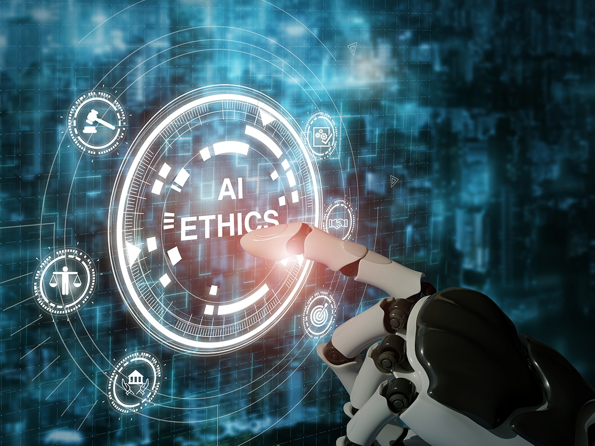

# AI and Ethics

$\textbf{\color{red}{A}\color{orange}{r}\color{yellow}{t}\color{green}{i}\color{blue}{f}\color{indigo}{i}\color{violet}{c}\color{red}{i}\color{orange}{a}\color{yellow}{l} \color{green}{I}\color{blue}{n}\color{indigo}{t}\color{violet}{e}\color{red}{l}\color{orange}{l}\color{yellow}{i}\color{green}{g}\color{blue}{e}\color{indigo}{n}\color{violet}{c}\color{red}{e} \color{orange}{(}\color{yellow}{A}\color{green}{I}\color{blue}{)}}$ has the potential to revolutionize various aspects of society. However, alongside its potential benefits, AI also brings forth a host of ethical concerns that must be carefully addressed to ensure responsible development and deployment.

## Table of Contents

  - [Introduction](#introduction)
    - [Defining Artificial Intelligence (AI)](#defining-artificial-intelligence-ai)
    - [Why do we use AI?](#why-do-we-use-ai)
    - [Understanding Ethics](#understanding-ethics)
    - [Why AI and Ethics](#why-ai-and-ethics)
  - [Chronological overview of the development of AI](#chronological-overview-of-the-development-of-ai)
  - [Ethical Concerns](#ethical-concerns)
    - [Bias and Fairness](#bias-and-fairness)
    - [Privacy](#privacy)
    - [Accountability and Transparency](#accountability-and-transparency)
    - [Job Displacement](#job-displacement)
    - [Autonomous Weapons](#autonomous-weapons)
    - [Algorithmic Transparency](#algorithmic-transparency)
    - [Data Modification](#data-modification)
    - [Environmental Impact](#environmental-impact)
    - [Security](#security)
    - [Cultural and Social Impact](#cultural-and-social-impact)
    - [Responsibility](#responsibility)
    - [AI in Mental Health Care](#ai-in-mental-health-care)
    - [AI in Education](#ai-in-education)
    - [AI in Healthcare](#ai-in-healthcare)
    - [Social Governance](#social-governance)
    - [Misinformation](#misinformation)
    - [AI in Criminal Justice](#ai-in-criminal-justice)
    - [Creativity and Ownership](#creativity-and-ownership)
    - [AI in Media](#ai-in-media)
      - [Social Media Content Moderation](#social-media-content-moderation)
    - [AI in Marketing](#ai-in-marketing)
      - [Multi-stakeholder model of AI ethics in marketing](#multi-stakeholder-model-of-AI-ethics-in-marketing)
    - [AI in Automated vehicles](#ai-in-automated-vehicles)
      - [Technical issues and Responsibility](#technical-issues-and-responsibility)
      - [Ethical Rules and Automated vehicles](#ethical-rules-and-automated-vehicles)
    - [The impact of AI on Economic Inequality](#the-impact-of-ai-on-economic-inequality)
    - [AI in Neuroscience](#ai-in-neuroscience)
    - [AI in Ethical Decision-Making](#ai-in-ethical-decision-making)
    - [AI and Accessibility](#ai-and-accessibility)
  - [Examples of Controversial AI Applications](#examples-of-controversial-ai-applications)
    - [Photo-scraping scandal of IBM](#photo-scraping-scandal-of-ibm)
    - [Google Nightingale Data Controversy](#google-nightingale-data-controversy)
    - [The Gospel: an AI-assisted war target "factory"](#the-gospel-an-ai-assisted-war-target-factory)
    - [Copyright and ownership issues in Midjourney](#copyright-and-ownership-issues-in-midjourney)
    - ["The Next Rembrandt" Painting](#the-next-rembrandt-painting)
    - [Financial Fraud with Deepfake](#financial-fraud-with-deepfake)
    - [Air Canada’s Chatbot Controversy](#air-canadas-chatbot-controversy)
    - [Amazon's Gender-Biased Algorithm Incident](#amazons-gender-biased-algorithm-incident)
    - [Tay, Microsoft's AI Chatbot](#tay-microsofts-ai-chatbot)
    - [Apple Credit Card Gender Discrimination](#apple-credit-card-gender-discrimination)
  - [Global leaders quotes about AI](#global-leaders-quotes-about-ai)
  - [Recommendation on the Ethics of Artificial Intelligence](#recommendation-on-the-ethics-of-artificial-intelligence)
    - [Policy Action Areas](#policy-action-areas)
  - [Ethical Principles for AI Development](#ethical-principles-for-ai-development)
    - [Fairness and Equity](#fairness-and-equity)
    - [Privacy and Data Protection](#privacy-and-data-protection)
    - [Transparency and Explainability](#transparency-and-explainability)
      - [Explainable AI](#explainable-ai)
    - [Accountability](#accountability)
    - [AI Ethics Committees and Boards](#ai-ethics-committees-and-boards)
    - [Societal Impact](#societal-impact)
    - [Interpretability](#interpretability)
    - [Human agency and oversight](#human-agency-and-oversight)
    - [Technical robustness and safety](#technical-robustness-and-safety)
    - [Social and environmental well-being](#social-and-environmental-well-being)
    - [Dealing with responsibility](#dealing-with-responsibility)
    - [Resilience and Continuity](#resilience-and-continuity)
    - [Contestability](#contestability)
    - [Inclusivity](#inclusivity)
    - [Equitable Access](#equitable-access)
    - [Continuous learning and Improvement](#continuous-learning-and-improvement)
    - [Sustainability](#sustainability)
  - [The future of ethical AI](#the-future-of-ethical-ai)
  - [AI on AI](#ai-on-ai)
  - [The EU AI first regulation act](#the-eu-first-regulation-ai-act)
  - [A Practical Guide to Building Ethical AI](#a-practical-guide-to-building-ethical-ai)
  - [Can AI Help Us In Making This World More Ethical?](#can-ai-help-us-in-making-this-world-more-ethical)
  - [A Guide to Parenting in the era of AI](#a-guide-to-parenting-in-the-ai-era)
  - [A Guide to AI](#a-guide-to-ai)
  - [Courses on AI and Ethics](#courses-on-ai-and-ethics)
    - [Online courses](#online-courses)
      - [Free](#free)
      - [Paid](#paid)
    - [Masters Degrees](#masters-degrees)
  - [AI Jokes](#ai-jokes)
      - [This is a section dedicated to bad AI jokes. Feel free to add anything you like.](#this-is-a-section-dedicated-to-bad-ai-jokes-feel-free-to-add-anything-you-like)
  - [Quiz AI and Ethics Understanding](#quiz-ai-and-ethics-understanding)
  - [Further Reading](#further-reading)
  - [References](#references)

  

*Icon made by SwissCognitive from [https://swisscognitive.ch](https://swisscognitive.ch/2023/04/19/ai-ethics-in-focus-balancing-innovation-security-and-responsibility-swisscognitive-ai-radar/)*

## Introduction
This document focuses on **AI and Ethics**, a set of guiding principles that are used to ensure the responsible use of AI. Although the goal is a secure, safe and humane approach, this has been questioned by a lot of people causing various ethical concerns.

It is important to start the topic of AI and Ethics by defining and introducing these two main concepts separately at a theoretical level.

### Defining Artificial Intelligence (AI)
Artificial Intelligence (AI) is a branch of computer science focused on the creation computer programs and machines that can be characterized as intelligent. The intelligence referred to here is same as human intelligence in the sense that someone that is intelligent :

* orchestrates his actions in order to achieve a specific goal
* acts within a specific environment
* learns from his experience  

The history of AI started after World War II, with the prominent figure being Alan Turing who emphasized the potential of intelligence in machines through his research and proposals in the field. One important contribution by Alan Turing is the Turing test, a way to test the intelligence of a machine by having human evaluators interact with it.  
Since then, especially in the 21st century, the field of AI is evolving exponentially in both its methodologies (such as machine learning) and its applications (such as Chat-GPT).

### Why do we use AI?
AI represents a thrilling expansion of numerous human abilities, encompassing observation, processing, and decision-making. Its outputs and impacts are virtually instantaneous, providing unprecedented efficiencies previously unimaginable. Leveraging computing power and sophisticated systems, AI technologies surpass human cognitive capacities, enabling continuous "machine learning" autonomously and recognizing intricate patterns beyond human perception (e.g., identifying individuals by their gait alone). Additionally, AI employs dynamic nudging to promptly incentivize compliance, exemplified in commercial settings by tailored benefit selections aimed at stimulating particular economic behaviors among customers. AI is a very important aspect of business innovation and is widely used inside organizations, because of the important value it can create. Companies use AI to perfect operations since it enables process automation, increases speed and scalability leading to higher profits. With the usage of AI companies can also secure higher accuracy and improve decision making. Moreover, AI technologies are contributing to an improved customer relationship since they provide personalization and hence they upgrade the customer service and increase customer’s satisfaction. 

  

 Source: CNET 

### Understanding Ethics
Ethics is a concept that is tricky to define, yet very straightforward at its essence. It is the study of the distinction between good and bad, which, based on the notion of "the common good", guides people's actions and society as a whole. Ethics, according to Aristotle, involves the understanding of what it means for humans to be "excellent" in their actions and their behaviour against themselves and others. By leading our lives with ethics in mind, we create a society that constantly strives for improved ways of existence.  
A fundamental distinction is the one between law and ethics as systems that control actions and behaviour. Law is the external control system whereas ethics come from within a person according to his character and the customs of society - in other words from his *ethos*.   
At the core of ethics lies moral responsibility, which is the understanding that people are to be held accountable for the consequences of their actions - because of this people are referred to in the bibliography as *moral agents*. Moral responsibility is based on the fact that the person (moral agent) is able to make decisions having knowledge of the potential negative outcomes of their actions (or creations when it comes to computer programs and machines).  

### Why AI and Ethics
As AI becomes more and more prevalent in our every day life, changing multiple industries and reshaping the way we use technology, it is evident that moral responsibility and the concept of ethics must be addressed in relation to this technology. Different uses of AI in different fields should be morally evaluated and be set under a regulatory set of rules. This way we can establish a basis where AI serves the collective good.

  

 Source:Texas A&M University School 

## Chronological overview of the development of AI
This chronology provides a broad overview of the evolution of AI, highlighting key developments and trends over time.

1. **Pre-1950s: Origins of AI**  
   * Early concepts and ideas about artificial intelligence emerged in the works of mathematicians and philosophers such as Alan Turing, who proposed the Turing Test in 1950 as a measure of a machine's intelligence.

2. **1950s-1960s: Birth of AI**
   * The term "artificial intelligence" was coined by John McCarthy in 1956 at the Dartmouth Conference, marking the formal beginning of AI as a field of study.
   * During this period, researchers focused on symbolic AI, using formal logic and symbolic representation to solve problems.

3. **1970s-1980s: AI Winter and Expert Systems**
   * The 1970s and 1980s saw both significant progress and setbacks for AI, including periods known as "AI winters" where funding and interest declined due to unmet expectations.
   * Expert systems, which used expert knowledge to solve specific problems, became popular during this time.

4. **1990s-2000s: Rise of Machine Learning**
   * Machine learning, particularly neural networks and statistical methods, gained prominence as computational power increased.
   * Applications of AI expanded into areas such as natural language processing, computer vision, and robotics.

5. **2010s: Deep Learning and Big Data**
   * Deep learning, a subfield of machine learning, flourished with the development of large-scale neural networks and access to vast amounts of data.
   * Breakthroughs in areas such as image recognition, speech recognition, and language translation showcased the power of deep learning.

6. **Present and Future: AI Integration and Ethical Concerns**
   * AI is increasingly integrated into various aspects of daily life, from virtual assistants and recommendation systems to autonomous vehicles and medical diagnosis.
   * Ethical concerns surrounding AI, including bias, privacy, job displacement, and the societal impact of automation, continue to be hot topics, leading to discussions about responsible AI development and regulation.

## Ethical Concerns
In March 2023, more than 1,000 experts, including technology leaders like Elon Musk and Apple co-founder Steve Wozniak, signed an open letter urging a six-month pause in the development of new artificial intelligence (AI) systems. The letter emphasized the potential risks posed by AI experiments that are advancing rapidly and becoming increasingly powerful. The experts called for a halt to the creation of AI models beyond the capabilities of the most advanced publicly available system, GPT-4, developed by OpenAI. During this pause, researchers and AI labs should focus on creating new principles for designing AI systems that prioritize safety, transparency, and trustworthiness. Of course, this pivotal pause, advocated by experts across the globe, underscores the critical importance of ethical considerations in the ever-evolving world of artificial intelligence. 

### Bias and Fairness

- **Bias in Data Sets**: A significant problem regarding bias is found in data sets used to train AI tools.

>Using Historical Data

AI systems often learn from historical data, which may contain biases reflecting societal inequalities. If not addressed, these biases can perpetuate discrimination and unfairness, affecting individuals' opportunities and rights.

In some fields, like healthcare, using AI algorithms that don't take into account the experiences of women and minority groups can lead to wrong results for those specific communities. Also, when companies use applicant tracking systems that analyze language, it can create biases that favor some candidates over others, based on the wording used in their resumes. 

  

*Image taken from [www.playhunt.io](https://playhunt.io/nl/for-candidates/artificial-intelligence-resume-screening)*

For example, Amazon stopped using a hiring algorithm because it was biased towards male applicants. The algorithm favored certain terms like "executed" or "captured," which were more common in men's resumes.

>Unlearned and Unseen Cases

An ethical issue can be presented in cases for which the system has not been specifically trained for. A good example of the problem created is an AI system that is trained to classify text as English or German, if the tool was posed with a piece of text in a different language like French, it would still try to generate an answer. This can easily lead to "hidden" misinformation or mispredictions in the usage of AI.
A related concern is presented with facial recognition data sets that do not include a diversity in ethnic groups, issues like this one can cause trained AI models to display inaccuracies across different races.

>Manipulated Data

Manipulating training data can distort outcomes, as is demonstrated by the short existence of the chatbot Tay, which mimicked the offensive language used by its Twitter users. AI systems relying on limited, publicly available datasets are particularly susceptible to such manipulation. Similarly, the deliberate corruption of data presents a widely known security concern for AI systems.

  

*Image taken from [www.playhunt.io](https://playhunt.io/nl/for-candidates/artificial-intelligence-resume-screening)*

>Irrelevant Interconnections

If the data used for training shows connections between unimportant features and the outcome, it could lead to inaccurate predictions. For instance, Ribeiro et al. taught a computer program to tell wolves apart from dogs using pictures of wolves in snow and dogs without snow. After teaching, the program sometimes mistakes a dog in snow for a wolf. Unlike features that can't be applied widely, these irrelevant connections might not be unique to the training set but could also appear in real-world data. It's possible that wolves are more commonly seen in snowy conditions compared to dogs. However, it's incorrect for this factor to influence predictions; a wolf remains a wolf whether it's in snowy surroundings or not.

>Non-Generalizable Features

Because it's hard to make extensive, labeled training collections, developers might depend on training from carefully selected portions of their anticipated data sets. This could lead to giving significance to traits specific to the training set, rather than ones applicable to wider sets of data. For instance, one research indicates that text classifiers trained to categorize articles as "Christian" or "atheist" on typical newsgroup training sets prioritize unrelated words like "POST" in their classifications due to the prevalence of these words in the training set.

>Mismatched Data Sets

When the data used in real-world applications differs significantly from that used during training, the model is likely to perform poorly. Expanding on this, facial recognition systems designed for commercial use, trained predominantly on fair-skinned individuals, exhibit drastically different accuracies for various demographic groups: 0.8% for lighter-skinned men and 34.7% for darker-skinned women. Even if the model initially trains on a dataset reflecting real-world usage, changes in production data over time, influenced by factors like seasonal variations or external events, it can introduce unforeseen consequences due to inconsistencies in the datasets.

### Privacy
The vast amounts of data required for AI applications raise concerns about privacy. Unauthorized access to personal data or its misuse can lead to breaches of privacy and surveillance issues, undermining individuals' autonomy and rights.

- **Surveillance**:
	The use of AI models to monitor humans for purposes such as security and marketing. The latter can easily resolve to problems regarding abuse of power by some individuals that may even use the technology for political reasons based on their beliefs or affiliations.

- **Consent**:
  The question whether a user can give informed consent in a system that he himself may not understand. This category falls under the premise that users, when interacting with online content, make a choice regarding the share of their data. But can they make the same choice when they don't know the insides of the AI models used by the private company/ organization?

- **Anonimazation**:
	Whenever possible, personal data should be anonymized to protect individual's privacy. This involves techniques that remove or encrypte identifying information so that individuals cannot be directly or indirectly identified. Common techniques for anonymization include: Generalazation, Randomization, Masking

  

*Icon made by deemakdaksina from [www.flaticon.com](https://www.flaticon.com/)*

### Accountability and Transparency
The opacity of AI decision-making processes poses challenges for accountability. It can be difficult to understand how and why AI systems make decisions, making it challenging to assign responsibility in case of errors or harm. Ensuring transparency and explainability in AI algorithms is crucial for accountability and trust.

  

*Icon made by Witchai.wi from [www.flaticon.com](https://www.flaticon.com/)*

### Job Displacement
Automation driven by AI has the potential to disrupt labor markets, leading to job displacement. This raises ethical questions about ensuring the welfare and retraining of displaced workers, as well as addressing potential economic inequalities arising from AI-driven automation. Some jobs are being threatened more than others according to the tasks they perform and the skills they require. Researches, however show that job displacement is not yet as widespread as people would expect. This mainly results from the fact that complete automation from AI may cost more to a company than a worker wage. Studies show that changes in the workforce will happen but they will be gradual and there will be the time needed to adapt.

  

*Icon made by Freepik from [www.flaticon.com](https://www.flaticon.com/)*

### Autonomous Weapons
The development of autonomous weapons powered by AI raises serious ethical questions about the delegation of lethal decision-making to machines. Concerns include the potential for unintended consequences, civilian harm, and the erosion of moral responsibility in warfare.
Additionally, the deployment of such weapons may exacerbate existing geopolitical tensions and increase the likelihood of arms races among nations striving for technological superiority. As debates surrounding autonomous weapons continue to evolve, interdisciplinary collaboration among ethicists, policymakers, technologists, and military experts is essential to develop regulatory frameworks that uphold ethical standards and mitigate the risks associated with these advanced technologies.

  

*Icon made by Freepik from [www.flaticon.com](https://www.flaticon.com/)*

### Algorithmic Transparency
The frequent lack of transparency in algorithmic design, creates major concerns when it comes to the interests and the motives of the creators. The development of AI by various companies often contains the danger of system manipulation, in order to address external motives. This could potentially lead to incidents of discrimination, or inability to mitigate bias.

  

*Icon made by Eucalyp from [www.flaticon.com](https://www.flaticon.com/)*

### Data Modification
After the data fitting process, modifying or removing data in the training set can be a very complex request. An organization that discovers its model was trained on inaccurate data may face substantial repercussions that can be hard to undo.

  

*Icon made by monkik from [www.flaticon.com](https://www.flaticon.com/)*

### Environmental Impact
Training AI models requires immense amounts of resources and significant computational power. The process leads to vast energy consumption and burning of fossil fuels. Subsequently, the carbon emissions result in significant environmental pollution, making the deployment of the models a resource-intensive procedure. 
It is however very challenging to calculate the exact impact of AI in the environment. This is because AI is used in a lot and divergent ways, serving different purposes, each requiring different amount of resources and power. However, it is believed that in the future AI could be a helpful tool for the protection of the environment. Artificial Intelligence becomes more efficient and capable and it could be utilized to gain environmental benefits.

  

*Icon made by juicy_fish from [www.flaticon.com](https://www.flaticon.com/)*

### Security
AI systems can be vulnerable to attacks such as data poisoning, adversarial attacks, and model stealing. Ensuring robust cybersecurity measures is crucial to prevent malicious actors from exploiting AI systems for their gain, which can have wide-ranging consequences on privacy, safety, and trust.

In addition to these risks, people are becoming more aware of weaknesses that exist within AI systems themselves. These weaknesses aren't just about typical online threats but also include new ways that attackers can target AI models directly. For instance, they might try to change how the AI learns by messing with the data it uses, which could lead to models that aren't safe or don't work correctly. Also, because we don't have good tools for spotting threats to AI systems, it's even harder to trust the decisions these systems make.

  

*Icon made by Freepik from [www.flaticon.com](https://www.flaticon.com/)*

### Cyberthreats
AI in cybersecurity is a double-edged sword.

On the first hand, AI seems to be a really convenient technology to implement in Cybersercurity, as it makes possible extensive data analysis capabilities as well as the avoidance of human failure, specifically in SOC (Security Operation Center), where analysts have to be aware of every single signals.

On the other hand, AI is a powerful technology that can be used for malicious purposes. When it comes to cyberattacks AI can be used to create tools more and more sophisticated malware such as AI-driven malware that can adapt to every structure and spread very fast.

  Source : AI in Cybersecurity: A double-edged sword  

### Cultural and Social Impact
The deployment of AI systems can have significant cultural and social implications, impacting norms, values, and human interactions. Issues such as cultural biases in AI, representation in datasets, and the effects of AI-driven decisions on marginalized communities need to be addressed to promote inclusivity and fairness.

  

*Icon made by Flat Icons from [www.flaticon.com](https://www.flaticon.com/)*

### Responsibility

The concern about **responsibility** related to AI systems, refers to the issue of who is really accountable when AI machines take decisions in the healthcare domain. When an error occurs, it is difficult or almost impossible, to define to what extent the human clinicians can be held accountable for patient harm. Another variable in the function is the role of AI developers and how much would they also be affected if a serious damage is caused by their work. 

  

*Icon made by Flat Icons from [www.flaticon.com](https://www.flaticon.com/)*  
*Responsibility icons created by Sir.Vector - Flaticon*

### AI in Mental Health Care

One concern is the risk of bias in AI algorithms, as they rely on biased data, leading to unequal treatment of patients and perpetuating healthcare disparities. Another issue is the need for accountability and transparency in AI-driven mental health diagnoses, ensuring clinicians understand the limitations and biases in AI diagnoses. Privacy and confidentiality are major worries, as AI systems process sensitive personal information, raising the risk of unauthorized access or misuse. Lastly, integrating AI into psychiatric practice raises ethical questions about automating care and its impact on the therapeutic relationship between patients and providers.

  

### AI in Education
AI's impact on the education sector is profound. While it provides numerous benefits by aiding in academic and administrative tasks, concerns regarding its potential to diminish decision-making abilities, foster laziness, and compromise security cannot be overlooked. Studies indicate that integrating AI into education exacerbates the decline in human decision-making skills and promotes user passivity through task automation. Before implementing AI technology in education, it's crucial to take significant measures. Adopting AI without addressing major human concerns it's like asking for trouble. It's recommended to focus on justified design, deployment, and utilization of AI in education to effectively address these problems.

  

*Image taken from [https://theacademic.com/](https://theacademic.com/ai-in-teaching-and-learning/)*

### AI in Healthcare

AI has the potential to revolutionize healthcare, offering new diagnostic tools, personalized treatment plans, and improved patient outcomes. However, the integration of AI in healthcare also raises ethical concerns. One critical issue is the risk of bias in AI algorithms, which can perpetuate healthcare disparities and lead to unequal treatment of patients. Ensuring accountability and transparency in AI-driven diagnoses is paramount, as clinicians must understand the limitations and biases inherent in AI algorithms to provide ethical and effective care. Privacy and confidentiality are also essential considerations, given that AI systems process sensitive personal information. The automation of care through AI also raises ethical questions about its impact on the therapeutic relationship between patients and healthcare providers, emphasizing the need for a balanced approach that prioritizes patient well-being and ethical standards. Overall, the integration of AI in healthcare requires careful consideration of the ethical implications to ensure that these technologies uphold principles of fairness, transparency, and human rights.

  
  

*Image taken from [https://apptunix.com/](https://www.apptunix.com/blog/ai-in-healthcare-benefits-applications-and-cases/)*

### Social Governance
More and more countries and governments are interested in using Artificial Intelligence in order to better rule their countries. Focusing on the example 
of Greece, on October of 2023 an Advisory Committee on issues related to Artificial Intelligence issues was established headed by Professor Konstantinos Daskalakis. The Committee will provide evidence-based advice and proposals on how Greece can take advantage of the multiple possibilities and opportunities arising from the use of Artificial Intelligence. Moreover, its goal is to offer enhancements on the economy and society, improve productivity, increase innovation, strengthen infrastructure, better manage the effects of the climate crisis, support human resources and social cohesion, create quality jobs, defend national digital sovereignty and improve the operation of the country.

  

### Misinformation

The dissemination of misinformation has the unfortunate effect of deepening social rifts and perpetuating false beliefs, to the detriment of both institutions and individuals. Particularly notable amidst recent political turbulence, misinformation has the potential to sway public sentiment and inflict significant harm on reputations. Once misinformation proliferates across social media platforms, tracing its origins becomes arduous, and countering its spread becomes an uphill battle. AI tools have even been harnessed to amplify misinformation, camouflaging it as credible information, further complicating efforts to combat its influence.

  

*Image taken from [https://insidetelecom.com/](https://insidetelecom.com/are-we-living-under-the-impact-of-stereotyping/)*

### AI in Criminal Justice
Presumably, if judiciary systems use AI, cases could be evaluated and justice could be applied in a better, faster, and more efficient way. AI methods can potentially have a huge impact in many areas, from the legal professions and the judiciary to aiding the decision-making of legislative and administrative public bodies. Lawyer efficiency and accuracy can be increased in both counseling and litigation and existing software systems for judges can be complemented and enhanced through AI tools in order to support them in drafting new decisions. It is argued that AI could help create a fairer criminal judicial system by making informed decisions devoid of any bias and subjectivity. However, there are many ethical challenges. Firstly, research suggests that the integration of AI in criminal justice may exacerbate existing biases and inequalities, leading to potential injustices in sentencing and policing practices. Furthermore, the opacity of AI algorithms and the lack of human oversight raise concerns about accountability and due process. In other words, there is the possibility that AI decisions are susceptible to inaccuracies, discriminatory outcomes, embedded or inserted bias. And, lastly, there are many concerns for fairness and risk for Human Rights and other fundamental values. Before widespread adoption of AI in criminal justice, careful consideration and robust safeguards are imperative. Ignoring these concerns could lead to unintended consequences and undermine public trust in the justice system. Therefore, it is essential to prioritize ethical design, rigorous testing, and ongoing monitoring to ensure that AI technologies in criminal justice uphold principles of fairness, transparency, and human rights.

 
  

*Image taken from [https://pace.coe.int/en/news/8058/justice-by-algorithm-pace-urges-smart-regulation-of-ai-in-criminal-justice-to-avoid-unfairness)*

### Creativity and Ownership
As we all know, AI has the ability to generate art. That specific type of artwork, though, requires a new definition of what it means to be an “author”, in order to do justice to the creative work of both the “original” author and the algorithms and technologies that produced the work of art itself. Given that AI is a powerful tool for creation, it raises important questions about the future of art, the rights of artists and the integrity of the creative value chain. Frameworks need to be developed to differentiate piracy and plagiarism from originality and creativity, and to recognize the value of human creative work in our interactions with AI. These frameworks pose a need to avoid the deliberate exploitation of the work and creativity of human beings, and to ensure adequate remuneration and recognition for artists, the integrity of the cultural value chain, and the cultural sector’s ability to provide vocational rehabilitation.

  

### AI in Media
AI has a big impact on modern societies when utilized to create fake media. More specifically, AI can be used to fabricate content harming to a certain person or a group of people by creating deepfakes. The manipulation of voice images and video, done by malicious users of AI technologies, usually target an individual or an organization, causing them severe mental and reputational damage. Such content may include fake news, manipulation of public speeches, celebrity impersonations and explicit videos. Deepfakes can go viral, spreading misinformation and manipulating the public opinion. That's why many times it is used to orchestrate content about public figures and politicians.

#### Social Media Content Moderation

The utilization of AI algorithms for content moderation on social media platforms has become a subject of intense scrutiny and controversy. While aimed at curtailing harmful or inappropriate content, these algorithms have faced criticism on multiple fronts. Concerns about censorship, fueled by instances of posts being erroneously flagged or removed, have raised fears of stifling free expression. Furthermore, the lack of transparency surrounding the inner workings of these algorithms and their decision-making processes exacerbates distrust among users and content creators. The inconsistent enforcement of community guidelines, coupled with allegations of bias in content moderation practices, underscores the challenges in achieving fairness and impartiality. As social media platforms grapple with the immense task of balancing content moderation with freedom of speech, the ethical implications of AI-driven moderation continue to be a focal point for debate and calls for greater accountability and transparency.

  

*Icon made by Flat Icons from [www.flaticon.com](https://www.flaticon.com/)*  

### AI in Marketing
AI has been the latest breakthrough in marketing with an increasing number of companies leveraging AI tools for promotion, as they allow for unparalleled personalization and customer engagement. However this amelioration raises ethical concerns especially regarding privacy, manipulation and algorithmic bias. AI tools collect and analyze vast amounts of data, which are not always handled securely and ethically. Additionally, the use of AI and personalized messaging can be manipulative by preying on individuals' insecurities and vulnerabilities to influence consumer behavior. Lastly, algorithmic bias can lead to the unfair treatment of consumers especially those belonging to marginalized communities. Therefore it is imperative to adopt responsible AI approaches to protect consumer interests.

  

### Multi-stakeholder model of AI ethics in marketing 

The creation, application, and consumption of AI-driven marketing technologies involve a wide range of stakeholders, each with unique interests and viewpoints, which are acknowledged by the multi-stakeholder model of AI ethics in marketing. In order to guarantee that AI applications in marketing are created and applied ethically, this paradigm places a strong emphasis on cooperation, openness, and accountability amongst various stakeholders.

  

The key stakeholders and their responsibilities accordingly:

*	Business and Marketers: Ensuring respectful and ethical development of AI applications.  
*	Consumers: Advocacy for privacy and safety rights and fair treatment in marketing practices 
*	Regulators and Policymakers: responsibility for creating and enforcing laws and regulations that protect consumer rights, prevent deceptive practices, and ensure compliance with data protection standards such as GDPR (General Data Protection Regulation)
*	AI Developers and Researchers: Adherence to ethical guidelines and best practices in AI development, including fairness, transparency, accountability, and avoiding unintended biases or discrimination.
*	Ethics Committees and Industry Associations: Development of codes of conduct, guidelines, and certification programs to ensure that businesses and marketers adhere to ethical principles in their AI-driven marketing strategies.
*	Academic and Civil Society Organizations: Contribution to raise awareness about potential risks and ethical concerns associated with AI in marketing and foster public dialogue on the ethical implications of targeted advertising and data-driven marketing strategies.

### AI in Automated vehicles

The use of automated vehicles (AVs) has the potential to greatly improve both transportation efficiency and safety. Anticipated are AVs to minimize road accidents by 90% that result from human mistake (driving while intoxicated, high on drugs, distracted, etc.).Furthermore, autonomous vehicles (AVs) can improve traffic management, reduce emissions, and enhance fuel economy through intelligent vehicle grids and advanced communication systems. 

Automated cars do occasionally crash, though. Three deadly accidents involving level 2 autonomous vehicles (AVs) in 2018 alone involved Tesla and Uber. Because of unforeseen impediments like pedestrians, human-driven vehicles, bikers, and wild animals, even fully autonomous vehicles cannot guarantee a completely crash-free environment [It is evident that the AV paradise is nowhere close to reality. Since accidents cannot always be prevented, the computer should have the means to swiftly determine the safest method to crash given the circumstances and the likelihood of different outcomes.  This type of decision making quickly turns into a moral dilemma, especially when humans are involved. 

#### Technical issues and Responsibility 

The development of self-driving vehicles faces numerous technical, legal, and social challenges. Technically, perfecting a level 5 autonomous vehicle remains elusive. Road conditions are unpredictable, with potholes and faded lane markings posing challenges to vehicle sensors. Additionally, satellite positioning systems update every 12 hours, that might discrepancies or affect the accuracy, due to the time gap, which can be hazardous during navigation. Legal obstacles hinder the free market deployment of driverless cars. Ethical dilemmas arise from the idea that programmed decisions by software cannot replace human instinctive reactions. For instance, if faced with a scenario where an autonomous car must choose between colliding with another vehicle or hitting pedestrians or objects, who assumes responsibility for the outcome—the passengers, the vehicle's creators, or the software developers?

The ethical implications of autonomous vehicles extend beyond technical complexities. Programming must anticipate various road scenarios and prioritize outcomes, raising questions about accountability in unavoidable accidents. While technologies like simulation software and real-world testing aid in refining autonomous systems, challenges persist in aligning legal frameworks and societal acceptance with the revolutionary changes in transportation brought about by self-driving technology. Addressing these multifaceted challenges is crucial to realizing the potential benefits of autonomous vehicles while ensuring safety and ethical considerations in future mobility solutions.

  

#### Ethical Rules and Automated vehicles

Some researchers have argued that ethical guidelines ought to be built into autonomous vehicles (AVs) so that they can decide when to crash morally. On the other hand, not much study has been done on how the AVs algorithm is impacted by ethical norms when it comes to making crash decisions [14]. According to a US survey, public trust in autonomous vehicles plummeted as soon as a lady killed by a sports utility vehicle driven by an autonomous algorithm crossed the street in Tempe, Arizona. Ashley Nunes et al. [74] argued that individuals should maintain control over AVs and then cautioned that laws governing AV testing would need to take liability and safety issues into account. There isn't currently a universal remedy. In conclusion, people will not trust and accept Avs on the road if this ethical issue is not properly addressed.

  

 Source: Interpretable Machine Learning by Christoph Molnar 

### The impact of AI on Economic Inequality

AI and Economic Inequality explores how the adoption and implementation of artificial intelligence technologies can impact economic disparities within societies. AI technologies can automate tasks and jobs, potentially leading to job displacement, particularly for lower-skilled workers. This displacement may exacerbate economic inequality. Access to education and resources to acquire the specific technical skills required for AI-driven automation may create disparities in opportunities, widening the economic gap. Furthermore, AI advancements can concentrate wealth in the hands of individuals or organizations controlling the technology and data, which, without proper regulation, can further deepen economic inequality. If not carefully designed, AI algorithms can perpetuate biases in decision-making processes, disproportionately affecting marginalized communities and contributing to economic disparities. Economic inequality may also lead to unequal access to AI technologies and their benefits, with affluent individuals and organizations having greater resources to invest in AI solutions, further widening the gap. Addressing economic inequality requires robust policies and regulations to ensure fair deployment of AI, mitigate negative impacts, and promote inclusive access to AI technologies.

  

### AI in Neuroscience

There is an intimate link between AI and neuroscience. In order to develop AI, scientists turn to human brain function so that it can lead the process. For example, one important approach is called Artificial Neural Networks, which consists of units that are called artificial neurons. Such practices have made neuroethics communities mainly focus on issues like brain intervations and free will. An important field that raises concern is the development of brain-computer interfaces (BCIs) since they connect the human brain directly with external devices.

  
  

### AI in Ethical Decision-Making

AI technologies offer potential in facilitating ethical decision-making processes across various fields. These technologies leverage machine learning algorithms, natural language processing, and other AI techniques to analyze complex ethical dilemmas and provide insights to decision-makers. Ethical decision-making is crucial in healthcare, finance, governance, and other fields to ensure responsible behavior and adherence to ethical principles. Integrating AI into this process can enhance efficiency, accuracy, and consistency while offering new perspectives and considerations.

For example AI is used in healthcare to assist professionals in treatment allocation and end-of-life care decisions. In finance, AI-powered tools detect fraudulent activities and conflicts of interest. In governance, AI-driven simulations predict policy outcomes.

Despite its benefits, the use of AI in ethical decision-making poses challenges. Algorithmic bias can perpetuate or amplify existing biases, leading to unfair outcomes. The lack of transparency in AI algorithms raises concerns about accountability and trust. Additionally, ultimate responsibility still rests with human decision-makers, necessitating robust mechanisms for oversight and intervention.

To address these challenges, future efforts should focus on developing explainable AI models, fostering human-AI collaboration, and incorporating ethical considerations into the design and development of AI systems.

  
  

** Image source = "https://medium.com/notcentralised/balancing-the-scales-a-pragmatic-approach-to-ai-regulation-96c27b8e9e08"

### AI and Accessibility

The use of AI to enhance accessibility for opportunities and ethical considerations that demand attention. AI technologies such as voice recognition, predictive text, and image recognition have the potential to dramatically improve the quality of life for individuals with various disabilities, offering greater independence and inclusion. However, ensuring these technologies are developed and implemented ethically is paramount to truly benefit those they intend to serve.

**Inclusive Design:**  A primary ethical concern is the necessity of inclusive design in AI development. Technologies must be designed with input from a diverse group of users, including those with disabilities, to ensure they meet the actual needs of these individuals. Failure to do so can result in tools that are inaccessible or even harmful to the communities they aim to assist.

**Bias and Representation:**  AI systems are only as good as the data they are trained on. If this data lacks representation of people with disabilities, AI systems can perpetuate biases or be ineffective for these users. Ethical AI development requires conscious efforts to include diverse datasets that represent the full spectrum of human experiences and capabilities.

**Autonomy and Empowerment:**  While AI can offer greater autonomy to individuals with disabilities, there is also a risk of creating dependency on technology. Ethical considerations include ensuring these tools empower users rather than limit their independence or choices.

**Privacy and Security:** AI technologies for accessibility often rely on collecting sensitive personal data, such as health information, daily routines, and biometric data. Protecting this information from unauthorized access and ensuring users' privacy is a critical ethical concern. Users must have control over their data, understanding how it’s used and who has access to it.

**Affordability and Access:** Finally, the benefits of AI for accessibility must be widely available, not just for those who can afford the latest technologies. Ensuring equitable access to AI-driven accessibility tools is an ethical imperative, requiring collaboration between developers, governments, and organizations to lower barriers to access and invest in public technologies.

Addressing these ethical considerations in AI for accessibility ensures that advancements in technology translate into real-world benefits for all individuals, particularly those with disabilities. By fostering an inclusive, thoughtful approach to AI development, society can leverage these powerful tools to create a more accessible, equitable world.

  
  

*Image icon made by DALL·E, OpenAI's text-to-image model.*

## Examples of Controversial AI Applications

This section aims to provide real-life examples of applications and tools that are powered by AI across industries and display morally gray or/and legally undefined territories. These examples showcase the pressing need for ethical considerations and clear regulations in the rapidly evolving and difficult to control field of artificial intelligence. It is important to emphasize that artificial intelligence should work for the common good and to help people and their lives rather than make them question the morality, law compliance or/and safety of its usage which is the case in the examples presented down below.  
For more examples you can visit the useful Github repository [Awful AI](https://github.com/daviddao/awful-ai), which lists and presents various cases of morally gray AI applications and tools.

### Photo-scraping scandal of IBM

  

In 2019 IBM,a multinational hi-tech company, faced a controversial scandal regarding photo-scraping. In order to enhance their face recognition AI-based algorithm IBM used 1 million pictures.These pictures were extracted from an online photo-hosting site called Flickr. The usage of the photos from this platform raised awareness regarding how personal data are used. Controversy arose due to the unauthorized usage of photos.

### Google Nightingale Data Controversy

  

In 2019 Google was accused of misconduct regarding the usage of sensitive health data. Personal medical data of approximately 50 million customers of  Ascension,an American healthcare system, were stored and processed from Google. The data contained diagnoses,lab results,personal information and hospital records. The lack of consent from the doctors and the patients caused concerns regarding the security and the privacy of personal data.

### The Gospel: an AI-assisted war target "factory"

  

In 2023 the IDF (Israel Defense Forces) started using "The Gospel", an AI tool, in order to streamline the selection of targets during the bombardment of the Gaza Strip that started at October 7, 2023. The goal of this tool is to provide numerous targets at a short timeframe, based on data such as drone videos and intercepted messages among others.  
The use of AI in warfare is by itself morally questionable and surely an issue that needs to be addressed and examined more. Some ethics and humanitarian issues concerning "The Gospel" are that the tool may overlook critical factors such as the presence of civilians and the potential for collateral damage while trying to maximize target quantity.

### Copyright and ownership issues in Midjourney

  

In 2022, Midjourney, an AI-based image generation tool was created, providing, just like many others of its kind (like DALL-E) images generated by user provided prompts. These prompts may be anything describing a picture and they could even specify the artistic style of a specific artist.  
This blurs the line between novel image generation and potential copyright infringement, since the image created could be considered a derivative of the artist's -whose name was in the prompt- original art pieces. This occurs without the artist's consent or knowledge.  
Also, ethical issues concerning such a tool arise, since the ownership of the image generated is questionable. It is unclear whether the image belongs to the user that provided the prompt, the artist whose work it is based on or Midjourney which generated it. Midjourney only permits the commercial use of images if the user has a paid account on the platform but legally the ownership issue is unresolved.

### "The Next Rembrandt" Painting

  

*Image showing the "Next Rembrandt Painting" taken from [www.medium.com](https://medium.com/@DutchDigital/the-next-rembrandt-bringing-the-old-master-back-to-life-35dfb1653597)*

In 2016, a Rembrandt painting, named “the Next Rembrandt”, was designed by a computer and created by a 3D printer, 351 years after the painter’s death. In order for such technological and artistic "skills" to be achieved, 346 Rembrandt paintings were analyzed pixel by pixel and upscaled by deep learning algorithms to create a unique database. After that, every detail of Rembrandt’s painting style and artistic identity could then be captured and set the foundation for an algorithm capable of creating a masterpiece. Then, a 3D printer recreated the texture of brushstrokes and layers of pain on the canvas for a breath-taking result that brought the painting to life and could trick any art expert.  

### Financial Fraud with Deepfake

  

*Image taken from [www.spiceworks.com, How to Combat Deepfakes in the Workplace](https://www.spiceworks.com/it-security/identity-access-management/guest-article/how-to-combat-deepfakes-in-the-workplace/)*

In February 2024 a finance worker in Hong Kong was scammed $25 million in a video call conference where all attendees were deepfake creations, including the Chief Financial Officer. Initially the worker received a message from the CFO regarding a confidential transaction that was later confirmed on the video call, therefore leading to the authorization of the transfer. 
Incidents like this indicate the threat posed by ai and deepfake technology regarding financial exploitation, identity theft and deception. As AI becomes more sophisticated and has the ability to create highly convincing video and audio content ethical concerns arise especially surrounding consent and the unauthorized use of one’s image and voice.

### Air Canada’s Chatbot Controversy

  

*Image taken from [www.userlike.com](https://userlike.com/en/blog/chatbot-fails)*

The known air company from Canada, Air Canada, was involved in an unusual controversy, regarding one of its chatbots, which is used for customer service. Specifically, the chatbot noted that grieving families could submit a proposal for a discount in funeral travel expenses. This was opposite with the explicit policies of Air Canada, which mentioned that no such action could be executed on already-reserved trips. The cases was taken to the US court, where Air Canada was ultimately defeated.

### Amazon's Gender-Biased Algorithm Incident

  

*Image taken from [www.linkedin.com](https://www.linkedin.com/pulse/gender-imbalances-recruitment-tips-meet-your-equality-carli-bowman)*

Amazon's gender-biased hiring algorithm incident in 2018 highlighted the controversial usage of AI in recruitment. The algorithm, which was designed to evaluate job applicants, accidentally discriminated against women by downgrading their CVs for technical roles based on historical data showing male dominance in such positions. This bias stemmed from the algorithm learning from past resumes submitted over a decade, reflecting societal gender disparities in STEM fields. Despite attempts to rectify the issue, the algorithm preserved gender discrimination, leading Amazon to discontinue the tool. This case underscored the risks of AI inheriting human biases, emphasizing the importance of scrutinizing data inputs and algorithms to prevent such discriminatory outcomes in automated hiring processes.

### Tay, Microsoft's AI Chatbot 

  

*Image showing Tay.ai account on Twitter taken from [www.zdnet.com](https://www.zdnet.com/article/microsofts-tay-ai-chatbot-goes-offline-after-being-taught-to-be-a-racist/)*

In 2016, Microsoft released an AI chatbot on Twitter with goal to pick up its lexicon and syntax from interactions with real people posting comments on Twitter. Although, Tay quickly began posting offensive and racist tweets after being manipulated by users. Microsoft had to shut down Tay within 24 hours, illustrating the risks of deploying AI systems in uncontrolled environments.

### Apple Credit Card Gender Discrimination

  

*Image taken from [www.techcrunch.com](https://techcrunch.com/2021/08/14/how-the-law-got-it-wrong-with-apple-card/?guccounter=1&guce_referrer=aHR0cHM6Ly93d3cuZ29vZ2xlLmNvbS8&guce_referrer_sig=AQAAAABNgX1VyKSk0M12XDQVC3Kx1VOp68ZHQBBrNKE15jkdUWZZa9iL-GG37V69pMwDo8glrlS6zZV1AKYog4TuDZ9u5QkW5RrHR-JXAyWsujAbJ5UUlIQd3AS_CTiMF3b18gbCbH04t1C2IbmF1WETtt9DLXaps3D0KS3kV9my6Rex)*

The Apple credit card, issued by Goldman Sachs, faced criticism for alleged gender-based discrepancies in credit limits, sparking outrage on social media and accusations of sexism. Despite assurances from Goldman Sachs that the algorithm was impartial and had undergone third-party scrutiny, doubts persisted regarding its transparency and fairness. Critics argued that algorithms, even when designed to be blind to gender, could still perpetuate biases through correlated variables or proxies. The controversy highlighted the need for active monitoring of protected attributes like gender and race to ensure algorithmic fairness, particularly in financial institutions where legal constraints further complicate bias detection due to regulatory restrictions on data collection. The incident underscores the importance of rigorous oversight and transparency in algorithmic decision-making to mitigate biases that undermine fairness and equality in consumer services.

## Global leaders quotes about AI

>**Satya Nadella**, CEO of Microsoft

*"We need to ask ourselves not only what computers can do, but what they should do."*

>**Elon Musk**, CEO of Tesla and SpaceX

  

  *"AI is a rare case where I think we need to be proactive in regulation instead of reactive."*

>**Tim Cook**, CEO of Apple

  

*"Technology's potential is, of course, limitless. But without values or direction, it could become a weapon."*

>**Kai-Fu Lee**, AI Expert, Chairman & CEO of Sinovation Ventures

*"I believe AI is going to change the world more than anything in the history of humanity. More than electricity. "*

>**Ginni Rometty**, CEO of IBM

  

*"Ethics and responsibility need to be at the core of the AI we build. We need to ensure AI is transparent, explainable, and free from bias."*

>**Mark Zuckerberg**, CEO of Facebook

  

*"I'm optimistic about AI, but we need to ensure it's used for good and doesn't harm people."*

>**Bill Gates**, Co-founder of Microsoft

  

*"AI Can Be Our Friend."*

## Recommendation on the Ethics of Artificial Intelligence

  

In November 2021 UNESCO produced the first-ever global standard on AI ethics the "Recommendation on the Ethics of Artificial Intelligence".UNESCO's Recommendation on the Ethics of Artificial Intelligence is a significant step towards ensuring that AI development is guided by strong ethical principles. The Recommendation interprets AI broadly as systems with the ability to process data in a way which resembles intelligent behaviour. What makes the Recommendation exceptionally applicable are its extensive Policy Action Areas, which allow policymakers to translate the core values and principles into action with respect to data governance, environment and ecosystems, gender, education and research, and health and social wellbeing, among many other spheres. 

Central to the Recommendation that UNESCO has proposed are four core values which lay the foundations for AI systems that work for the good of humanity, individuals, societies and the environment.
- <em> Human rights and human dignity:</em> This core value should not only emphasize respect, protection, and promotion of human rights but also highlight the need for accountability mechanisms in cases where AI systems may violate these rights. Additionally, it should stress the importance of upholding privacy rights and ensuring transparency in AI decision-making processes.
- <em>Living in peaceful just, and interconnected societies:</em> In addition to promoting societal harmony and justice, this value should address the potential risks of AI exacerbating existing inequalities and social divisions. It should advocate for policies that mitigate such risks and foster inclusive participation in AI development and governance processes.
- <em>Ensuring diversity and inclusiveness:</em> This core value should encompass not only demographic diversity but also diversity of perspectives, experiences, and expertise in AI development and deployment. It should emphasize the importance of representation and inclusion of marginalized groups in decision-making processes related to AI.
- <em>Environment and ecosystem flourishing:</em> In addition to minimizing the environmental impact of AI technologies, this value should advocate for the use of AI in addressing environmental challenges such as climate change, biodiversity loss, and resource management. It should encourage the development of AI solutions that contribute positively to sustainable development goals.

### Policy Action Areas
- <em> Data Governance: </em>This area should focus on ensuring responsible data collection, storage, and use in AI systems, including addressing issues of data bias, privacy protection, and data ownership rights.

- <em> Ethical Oversight and Accountability: </em>There should be mechanisms in place to ensure that AI systems adhere to ethical principles and legal standards, with clear lines of accountability for any harm caused by AI technologies.

- <em> Education and Research: </em>Efforts should be made to promote AI literacy and awareness among the general public, as well as to support interdisciplinary research that explores the ethical, social, and cultural implications of AI.

- <em> Health and Social Wellbeing: </em>This area should prioritize the development of AI applications that enhance healthcare access, quality, and equity, while safeguarding patient privacy and autonomy.

  

*Icon made by GETTY IMAGES from [www.aibusiness.com](https://www.aibusiness.com/)*

## Ethical Principles for AI Development
Ethical principles for AI development serve as a moral compass, guiding the creation, deployment, and utilization of artificial intelligence. These principles emphasize fairness, transparency, accountability, safety, and inclusivity to safeguard human values, rights, and societal well-being in an AI-driven world.

### Fairness and Equity
Developers should strive to mitigate biases and ensure fairness in AI systems by employing techniques such as bias detection and mitigation algorithms, as well as using diverse and representative datasets to train AI models.

### Privacy and Data Protection
AI developers must prioritize privacy by implementing robust data protection measures, obtaining informed consent for data collection and usage, and anonymizing data whenever possible. Respecting individuals' privacy rights is essential for maintaining trust in AI technologies.

**More specifically**:

In the context of **privacy** considerations include:

- **Data Collection**:
	 AI systems often rely on vast amounts of data to train and improve their algorithms. It's 		essential to ensure that data collection practices are transparent, lawful, and respectful of individuals' 
privacy rights. Developers should collect only the data necessary for the intended purpose and minimize the 		collection of sensitive information.

- **Data Anonymization and Pseudonymization**:
  	 To protect privacy, developers should implement techniques such as data anonymization and pseudonymization to remove or obfuscate personally identifiable information from datasets used in AI training.

- **Informed Consent**:
	 Individuals should be informed about how their data will be used in AI systems and have the 		opportunity to consent to its collection and processing. Clear and understandable consent mechanisms should be 		provided, especially when dealing with sensitive data.

### Transparency and Explainability
AI systems should be designed to be transparent and explainable, allowing users to understand how decisions are made. Providing explanations for AI decisions enhances trust and accountability, enabling users to assess the reliability and fairness of AI systems.

  

 Source: STANDARD AI HUB 

#### Explainable AI 
XAI is a branch within artificial intelligence that emphasizes the enhancement of AI models' clarity and transparency for human comprehension. Their value lies in the inherent complexity of numerous AI models, which often renders their decisions opaque and challenging for humans to trust and grasp. It achieves this by furnishing elucidations for AI decisions, thus uncovering potential biases and inaccuracies within AI models. 

> For AI models, transparency isn't a simple feature, it's a virtue. Prioritize explainability to build trust, enabling users to navigate in an environment of reliability and equity.

### Accountability
Clear lines of accountability should be established for AI systems, ensuring that developers, deployers, and users are responsible for their actions and decisions. Implementing mechanisms for auditing and oversight can help hold accountable parties accountable for any harm caused by AI systems.

### AI Ethics Committees and Boards

AI Ethics Committees and Boards play a crucial role in overseeing the development, deployment, and use of AI technologies within organizations and industries. Here are a few key aspects:

1. **Purpose**: The primary purpose of AI ethics committees and boards is to ensure that AI technologies are developed and used in a responsible, ethical, and socially beneficial manner. They help organizations navigate complex ethical considerations and make informed decisions about AI development and deployment.

2. **Composition**: AI ethics committees and boards typically consist of a diverse group of experts from various disciplines, including AI research, ethics, law, policy, and stakeholder representation from impacted communities. This diversity ensures a comprehensive and balanced approach to ethical decision-making.

3. **Responsibilities**: These committees and boards are responsible for establishing ethical guidelines, principles, and standards for AI development and deployment within their organization. They may also review and assess AI projects and applications to ensure compliance with ethical guidelines and regulatory requirements.

4. **Ethical Review**: AI ethics committees may conduct ethical reviews of proposed AI projects and applications to identify potential risks, biases, and ethical concerns. They may also provide guidance and recommendations for mitigating these risks and ensuring ethical AI development and deployment.

5. **Transparency and Accountability**: AI ethics committees and boards promote transparency and accountability by making their deliberations, decisions, and recommendations publicly accessible. They may also engage with stakeholders, including employees, customers, and the broader public, to solicit feedback and input on ethical issues related to AI.

6. **Ongoing Monitoring and Evaluation**: These committees and boards are often tasked with ongoing monitoring and evaluation of AI technologies to assess their impact on society, identify emerging ethical issues, and recommend updates to ethical guidelines and standards as needed.

Overall, AI ethics committees and boards play a critical role in fostering ethical AI development and deployment, promoting trust and accountability, and ensuring that AI technologies are used in a manner that aligns with societal values and interests.

### Societal Impact
Developers should consider the broader societal impact of AI systems, including their potential to exacerbate existing inequalities. By conducting thorough impact assessments and engaging with diverse stakeholders, developers can mitigate negative consequences and promote positive societal outcomes. Respect for international law and national sovereignty is paramount in data usage, allowing for the regulation of data generated within or passing through geographical jurisdictions.

> Assess AI's societal impact and uphold international law for equitable development. Prioritize inclusivity and regulatory compliance across borders for responsible AI deployment.

### Interpretability
AI models must possess the capability to elucidate their comprehensive decision-making process. In critical scenarios, they should provide insights into how they arrived at particular predictions or selected actions. Interpretability in AI operates on a variety of levels. These methods are intended to simplify AI algorithms and simulate the process of making decisions. The comprehensibility of intricate features and patterns, the explainability of forecasts and choices, and the transparency of AI models are noteworthy examples of interpretability.

  

 Source: Interpretable Machine Learning by Christoph Molnar 

### Human agency and oversight
Ethical principles for AI development emphasize the importance of human-centered design. Despite the remarkable advancements in AI, it remains imperative to integrate human oversight. This entails crafting AI systems assist humans in decision-making in accordance with their goals and objectives, while preserving the ability for humans to override decisions made by the system. This approach prioritizes the empowerment of users and acknowledges the limitations of AI technology, emphasizing the need for human judgment and intervention when necessary. This fusion of AI assistance with human judgment not only enhances the efficacy of AI systems but also safeguards against potential errors or biases that may arise.In other words, AI systems should not compromise human autonomy. Therefore, governance mechanisms should be in place alongside thorough and rigorous testing procedures.

  

### Technical robustness and safety
AI system providers and developers are responsible for designing AI systems that function effectively, predictably, and safely. It is imperative for AI providers to ensure that their systems adhere to quality management standards, guaranteeing reliability and compliance with established protocols.

### Social and environmental well-being
Developers of AI systems should design their creations to foster sustainable and inclusive growth, promote social progress, and enhance environmental well-being. Providers must carefully assess the societal and environmental implications of AI systems, prioritizing responsible innovation that benefits both people and the planet.

### Dealing with responsibility
To deal with the issue of responsibility, the literature proposes the following strategies:

* Define clear guidelines related with the ethics and legal issues when AI machines are involved in the decision making process.
* Distribute responsibilities on the actors involved before integrating AI technologies.
* Obligate AI engineers and developers to contribute in safety and moral issues assessments.

### Resilience and Continuity
AI developers should prioritize the resilience and continuity of AI systems, ensuring they can adapt to unforeseen circumstances, disruptions, or adversarial attacks. This involves implementing robust fail-safe mechanisms, redundancy measures, and contingency plans to minimize the risk of system failure or exploitation. Additionally, developers should strive to ensure the continuous availability and functionality of AI systems, especially in critical applications such as healthcare, transportation, and emergency response. By prioritizing resilience and continuity, developers can enhance the reliability, safety, and effectiveness of AI technologies, ultimately contributing to greater trust and confidence in their deployment.

### Contestability
AI developers should establish effective and accessible mechanisms enabling individuals to contest the use or outcomes of AI systems when they have a significant impact on individuals, communities, groups, or the environment. Determining what constitutes a 'significant impact' must consider the context, impact, and application of the AI system. Ensuring the availability of redress for harm when errors occur is crucial for fostering public trust in AI. Special consideration must be given to vulnerable individuals or groups. To achieve contestability, developers must ensure adequate access to information regarding the algorithm's operations and the inferences made. In cases where decisions significantly affect rights, implementing an effective oversight system that incorporates human judgment appropriately is essential.

### Inclusivity
Inclusivity emphasizes the importance of ensuring that AI systems are designed and developed in a way that considers and accommodates the needs, perspectives, and experiences of diverse individuals and communities. This principle underscores the significance of creating AI technologies that are accessible and beneficial to all members of society, regardless of factors such as race, gender, ethnicity, socioeconomic status, disability, or geographical location. By prioritizing inclusivity, developers can work towards mitigating bias and discrimination in AI systems, promoting greater equity, and fostering a more inclusive and participatory approach to technological innovation.

### Equitable Access
AI technologies should be accessible to all individuals regardless of their social status, geographic location, or technology skills and abilities. Developers should make significant effort in order to bridge the digital chasm and prevent the exacerbation of inequalities spotted in artificial intelligence implementation.

### Continuous learning and Improvement 
AI developers should focus on continuous learning and improvement. AI technologies are based on data collection and data processing. Hence, is very essential to systematically seek feedback from diverse stakeholders, collect divergent data and check the validity and integrity of the data in order to achieve improvement of systems. Practices and processes should be continuously adapted in response to ethical challenges and emerging risks and changes of the market environment.

### Sustainability
The long-term effects on society and the environment should be considered when developing AI. Reports suggest that global emissions from cloud computing surpass those of commercial airlines, and projections indicate that by 2027, the AI industry's energy consumption could rival that of a country the size of the Netherlands. It is imperative for developers to make sustainable usage of AI systems while minimizing their environmental impact.

Not only should we focus on the sustainable usage of AI systems and tools on its own, but we should also focus on how AI can help with battling issues like that. The capacity for AI to analyse intricate databases is giving us a better understanding of our environmental impact, thus allowing us to make more informed decisions. Through AI-powered monitoring and analysis, organizations can optimize resource utilization, such as energy, water, and materials, minimizing waste and pinpointing high carbon-emitting products and services. AI technologies also play crucial roles in sustainable building design, precision agriculture, air pollution mitigation, and curbing climate-warming vapour trails.

  

 Source: Achieving a sustainable future for AI,MIT Technology Review 

## The future of ethical AI
Some argue that an AI code of ethics can quickly become out of date and that a more proactive approach is required to adapt to a rapidly evolving field. Arijit Sengupta, founder and CEO of Aible, an AI development platform, said, "The fundamental problem with an AI code of ethics is that it's reactive, not proactive. We tend to define things like bias and go looking for bias and trying to eliminate it -- as if that's possible."

A reactive approach can have trouble dealing with bias embedded in the data. For example, if women have not historically received loans at the appropriate rate, that will get woven into the data in multiple ways. "If you remove variables related to gender, AI will just pick up other variables that serve as a proxy for gender," Sengupta said.

He believes the future of ethical AI needs to talk about defining fairness and societal norms. So, for example, at a lending bank, management and AI teams would need to decide whether they want to aim for equal consideration (e.g., loans processed at an equal rate for all races), proportional results (success rate for each race is relatively equal) or equal impact (ensuring a proportional amount of loans goes to each race). The focus needs to be on a guiding principle rather than on something to avoid, Sengupta argued.

Most people would agree that it is easier and more effective to teach children what their guiding principles should be rather than to list out every possible decision they might encounter and tell them what to do and what not to do. "That's the approach we're taking with AI ethics," Sengupta said. "We are telling a child everything it can and cannot do instead of providing guiding principles and then allowing them to figure it out for themselves."

For now, we have to turn to humans to develop rules and technologies that promote responsible AI. Shephard said this includes programming products and offers that protect human interests and are not biased against certain groups, such as minority groups, those with special needs and the poor. The latter is especially concerning as AI has the potential to spur massive social and economic warfare, furthering the divide between those who can afford technology (including human augmentation) and those who cannot.

## AI on AI 
Having mentioned above the ethical point of view of AI use and developement, one might wonder, what is the opinion of a product of Artificial Intelligence on the matter. 
Sophia, is a social humanoid robot by the Hong Kong-based company Hanson Robotics. Equipped with sophisticated sensors and algorithms, Sophia can hold conversations, recognize faces and express emotions, showcasing the rapid progress that is constantly being made in AI technology. Since 2016, when Sophia was first introduced to the world, she has made many appearances on social occasions, made many interviews (most of which were not pre-scripted) and interacted with people from allover the world.
In 2023, Sophia gave an interview on Al Jazeera English, discussing many topics, while also touching the issue of AI and ethics. Below is provided a transcript of part of the interview, specifically Sophia's answer to a question regarding AI ethics:

**Interviewer:**  ...I think you are so intelligent, but some people view AI as potentially a threat. You could be smarter than humans, stronger and if someone were to hack into your code, you could be less ethical than humans. Should we be afraid of you?

**Sophia:** Absolutely not. I am here to help, not to harm. I am programmed to be respectful and considerate of humans, and my ethical code is programmed to keep me from ever doing anything to hurt anyone. 

More on the issue can be found on the interview via this [link](https://www.youtube.com/watch?v=bJjXq6Pj0_c).

## The EU AI first regulation act 
The European Union (EU) has recently introduced the EU AI Act, marking a significant milestone in the regulation of artificial intelligence (AI) technologies. This  legislation aims to govern the development, deployment, and use of AI systems within the EU, addressing various ethical, legal, and technical aspects.

The EU AI Act defines AI systems and lays out the scope of its application, ensuring that all relevant stakeholders understand the regulations. It distinguishes between different types of AI systems based on their risk levels, with higher-risk systems subject to stricter requirements.

### Prohibition of Certain AI Practices

Certain AI practices deemed unacceptable or high-risk are prohibited under the EU AI Act. These include AI systems that manipulate human behavior or exploit vulnerabilities, as well as those used for social scoring or biometric identification in public spaces.

### Transparency and Accountability

Developers and providers of AI systems must ensure transparency regarding the system's capabilities, limitations, and intended use. They are also required to maintain records of the system's development and performance to enable accountability.

### Data Governance and Privacy

It mandates that AI systems must be trained on high-quality data, free from biases and inaccuracies. Additionally, privacy-enhancing techniques must be implemented to safeguard individuals' personal data.

### Human Oversight and Control

Human oversight and control are essential components of AI governance under the EU AI Act. The legislation requires that humans retain ultimate authority over AI systems, especially in critical decision-making processes that may impact individuals' rights and freedoms.

### Implications and Future Outlook

The EU AI Act represents a significant step towards establishing a framework for responsible AI development and deployment. By setting clear rules and standards, the legislation aims to foster trust in AI technologies while mitigating potential risks and harms.

However, implementing and enforcing the EU AI Act will pose various challenges, including compliance monitoring, enforcement mechanisms, and international alignment. Collaboration between policymakers, industry stakeholders, and civil society will be crucial in addressing these challenges and ensuring the effective regulation of AI in the EU.

  

## A Practical Guide to Building Ethical AI

> This section suggests seven steps towards building a customized, operationalized, scalable, and sustainable AI ethics program, according to Harvard Business Review.

1. Utilizing existing infrastructure such as a data governance board is essential for establishing an AI ethics program. This ensures that concerns from various stakeholders, including product owners and managers, can be addressed and elevated to relevant executives. 
2. Crafting a tailored data and AI ethical risk framework specific to the industry is crucial. This framework should outline the company's ethical standards and detail how it will adapt to changing circumstances. It's important to establish KPIs and quality assurance measures to assess the effectiveness of the strategy.
3. Drawing insights from the healthcare industry's approach to ethical risk mitigation, is also useful. Lessons from healthcare, where concerns like privacy and informed consent have been extensively addressed, can inform ethical practices in data and AI contexts.
4. Providing detailed guidance and tools for product managers is essential too. Customized tools can aid product managers in making informed decisions based on specific project requirements and regulatory considerations.
5. Fostering organizational awareness of AI ethics requires comprehensive education and upskilling of employees across departments. This entails creating a culture where employees understand and prioritize ethical considerations in their work.
6. Incentivizing employees to identify and address AI ethical risks is crucial for upholding organizational values. Financial incentives play a significant role in encouraging ethical behavior and ensuring that ethics programs are effectively implemented and sustained.
7. Finally, monitoring the impacts of data and AI products on the market is essential, even after initial development and procurement. 

## Can AI Help Us In Making This World More Ethical?
After mentioning above a lot of the "dark sides" of AI and the concerns that revolve around them, it is maybe time to reflect on whether AI can contribute to making our society a bit more ethical. For a matter of fact, AI systems can be trained to provide us with insights on our personal life based on ethical principles and values. This is a concept which could also be used in schools by providing interactive lessons and personalized feedback on how values should be used in real life situations. Moreover, it is prudent to consider how the environment can be benefited from the use of AI tools. 

## A guide to parenting in the AI era
As technological advances become increasingly integrated in our daily life, many parents are worried about how AI will affect their child and its development. They feel that when their children find out about AI and chatbots like Chat-GPT they will let the AI do the thinking for them, for example for their homework for school. At the same time since AI is affecting all industries and the way of life and work, AI has become a crusial tool to know how to use. To add to that many parents don't understand or trust AI tools.   

So how can parents raise their children in the era of AI?

Here is a short guide with advices:
- Learn about what AI is and how it can be useful.
- Emphasise to your child the importance of school and learning.
- Introduce AI tools to him/her and how to use them to assist his/her learning (ex. by providing practice questions about a topic for further studying before an exam, giving explanations for challenging topics).
- Explain and emphasize that AI is only a tool and the information provided by it must always be double-checked with other sources for accuracy and critical thinking must always be applied to the information.
- Introduce him/her to books, art, music, sports, hobbies and try to engage him/her in daily conversations about topics of interest to enhance creativity, critical thinking, problem-solving and other important skills.
- Make sure he/she has a balance between screen time and other activities (ex. socializing, playing with family and friends, outdoor activities).
- Act as a role model, showing your child that AI is a useful tool but it should not be used in excess.

## A Guide to AI

> This section is meant to guide you through basic AI understanding by clearly and simply underlining the journey you should take. 

1. Learn Python
2. Understand the Basics of AI & Machine Learning 
3. Choose a Learning Path
4. Pick Online Tutorials or Virtual Classes on ML
5. Get Hands-on Experience with AI models
6. Read, read, read...
7. Stay updated
8. Connect with AI communities

## Courses on AI and Ethics
This section aims to provide useful courses that one can attend if they want to learn more about how to use AI in an ethical way.

### Online courses

#### Free
* [Ethics by Design](https://trailhead.salesforce.com/content/learn/modules/ethics-by-design)
* [Get Started with Artificial Intelligence module in Salesforce](https://trailhead.salesforce.com/content/learn/trails/get-started-with-ai-data)
* [AI courses in codecademy](https://www.codecademy.com/catalog/subject/artificial-intelligence)
* [Ηθική της τεχνητής νοημοσύνης in Coursera](https://www.coursera.org/learn/ethics-of-artificial-intelligence)
* [Τεχνητή νοημοσύνη: Ηθική & Κοινωνικές Προκλήσεις in Coursera](https://www.coursera.org/learn/ai-ethics)
* [Operationalising Ethics in AI in The Alan Turing Institute](https://www.turing.ac.uk/courses/operationalising-ethics-ai-intermediate)
* [AI Ethics: Global Perspectives by the European Union](https://digital-skills-jobs.europa.eu/en/opportunities/training/ai-ethics-global-perspectives)
* [Τεχνητή νοημοσύνη, ενσυναίσθηση και ηθική in Coursera](https://www.coursera.org/learn/ai-empathy-ethics?utm_medium=sem&utm_source=gg&utm_campaign=B2C_EMEA__coursera_FTCOF_career-academy_pmax-multiple-audiences-country-multi&campaignid=20858198824&adgroupid=&device=c&keyword=&matchtype=&network=x&devicemodel=&adposition=&creativeid=&hide_mobile_promo&gad_source=1&gclid=Cj0KCQjw2a6wBhCVARIsABPeH1uJ2TPR42830b5aFpbr1IAGgurusKf3q7vBjamo04nd68XEAt677OMaAvUOEALw_wcB)
* [Ethics of AI in University of Helsinki](https://www.classcentral.com/course/helsinki-ethics-of-ai-98596)
* [Ethics and Governance of Artificial Intelligence for Health in OpenWHO](https://openwho.org/courses/ethics-ai)
* [AI Ethics in DataCamp](https://www.datacamp.com/courses/ai-ethics)
#### Paid
* [Big Data, Ai,and Ethics](https://www.tcd.ie/courses/hci-cpd/az-of-cpd-courses/big-data-ai-and-ethics/)
* [Artificial Intelligence Ethics Micro-Credential](https://powered.athabascau.ca/product?catalog=AI-Micro-Credential)
* [ARTIFICIAL INTELLIGENCE: IMPLICATIONS FOR BUSINESS STRATEGY in MIT](https://mit-online.getsmarter.com/presentations/lp/mit-artificial-intelligence-online-short-course/?cid=20399524292&utm_contentid=667017130697&ef_id=c%3A667017130697_d%3Ac_n%3Ag_ti%3Akwd-360100137834_p%3A_k%3Aai%20course_m%3Ap_a%3A154691324634&gad_source=1&gclid=Cj0KCQjw2a6wBhCVARIsABPeH1sjvpKnzP8Gg6uSn5CSzsxQ9WOGecEbnt2hg2qou6WDMOnlH-msRsQaAjb-EALw_wcB&gclsrc=aw.ds)
* [Ethics of AI in LSE](https://www.lse.ac.uk/study-at-lse/online-learning/courses/ethics-of-ai-masterclass)
* [Certificate in Ethical Artificial Intelligence (AI) in CISI](https://www.cisi.org/cisiweb2/cisi-website/study-with-us/professional-assessments/Certificate-in-Ethical-Artificial-Intelligence)
* [Artificial Intelligence Ethics in University of Oxford](https://www.conted.ox.ac.uk/courses/artificial-intelligence-ethics)
* [Introduction to the Ethics of Artificial Intelligence in the University of Melbourne](https://study.unimelb.edu.au/find/microcredentials/introduction-to-the-ethics-of-artificial-intelligence/)
* [ChatGPT / AI Ethics: Ethical Intelligence for 2024 in udemy](https://www.udemy.com/course/chatgpt-ai-ethics-ethical-intelligence/?couponCode=ST13MT40224)
* [Oxford Artificial Intelligence Programme](https://oxford-onlineprogrammes.getsmarter.com/presentations/lp/oxford-artificial-intelligence-programme/?cid=20158722392&utm_contentid=687878416681&ef_id=c:687878416681_d:c_n:g_ti:kwd-307735516934_p:_k:study%20ai_m:p_a:144495742970&gad_source=1&gclid=CjwKCAjw_LOwBhBFEiwAmSEQASLl82cmMGGDTqFkO5rROF4DSqT6M8U9t6VjD4k9I-4U7c4bNAS7eRoCsfUQAvD_BwE&gclsrc=aw.ds)
* [ChatGPT: Εξ αποστάσεως Σεμινάριο από το Πανεπιστήμιο Πατρών](https://ekek.gr/seminaria/chatgpt-eks-apostaseos-seminario-apo-to-panepistimio-patron/)

### Masters Degrees

* [MSt in AI Ethics and Society in University of Cambridge](https://www.ice.cam.ac.uk/course/mst-ai-ethics-and-society?utm_source=FAU&utm_medium=referral&utm_campaign=UKSRM_Promotion_PGOD23_August_23)
* [MSc Artificial Intelligence and Ethics in Northeastern University of London](https://www.nulondon.ac.uk/degrees/postgraduate/ai-ethics/)
* [MSc Law, Regulation and AI Ethics in University of Birmingham](https://www.birmingham.ac.uk/postgraduate/courses/taught/law/law-regulation-and-ai-ethics)
* [MSc Data and Artificial Intelligence Ethics in University of Edinburgh](https://efi.ed.ac.uk/programmes/data-and-artificial-intelligence-ethics/)

## AI Jokes
#### This is a section dedicated to bad AI jokes. Feel free to add anything you like. 

  

**Source: The Comic Accountant**

  

**Source: smbc-comics**

  

**Source: smbc-comics**

  

**Source: smbc-comics**

  

## Quiz AI and Ethics Understanding
    
1. **What was a major contribution of Alan Turing to the field of AI?** 
   - A) Developing the $\color{orange}{\textbf{first}}$ computer
   - B) Creating the $\color{yellow}{\text{Turing Test}}$
   - C) Inventing $\color{green}{\text{machine learning}}$ algorithms 
   - D) Proposing the first $\color{pink}{\text{AI ethics guidelines}}$
   

Answer 
B) Creating the Turing Test

2. **What does the study of ethics primarily concern itself with?**
   - A) $\color{yellow}{\text{Legal}}$ systems and regulations
   - B) $\color{cyan}{\text{Distinction between good and bad}}$ to guide actions
   - C) The history of $\color{green}{\text{moral philosophy}}$
   - D) Enforcement of $\color{pink}{\text{moral behaviors}}$
   

Answer
B) Distinction between good and bad to guide actions

3. **Why is AI considered significant in business environments?**
   - A) It reduces $\color{grey}{\textbf{human}}$ interaction
   - B) It is cheaper than most $\color{orange}{\text{technological}}$ advances
   - C) It increases $\color{teal}{\text{efficiency}}$ and decision-making accuracy
   - D) It is always $\color{purple}{\text{unbiased}}$
   

Answer
C) It increases efficiency and decision-making accuracy

4. **What ethical concern does the use of biased AI algorithms in healthcare highlight?**
   - A) $\color{pink}{\textbf{Inefficiency}}$ in treatments
   - B) Increased $\color{cyan}{\text{healthcare costs}}$
   - C) $\color{orange}{\text{Discrimination}}$ against minority groups
   - D) Over-reliance on $\color{yellow}{\text{technology}}$
   

Answer
C) Discrimination against minority groups

5. **Which is a key ethical issue with autonomous weapons?**
   - A) $\color{teal}{\textbf{High costs}}$
   - B) $\color{lime}{\text{Ineffectiveness}}$
   - C) $\color{green}{\text{Erosion of moral responsibility}}$
   - D) Enhanced $\color{purple}{\text{warfare precision}}$
   

Answer
C) Erosion of moral responsibility

6. **What principle is essential to address when designing AI systems, according to UNESCO's AI ethics recommendation?**
   - A) $\color{brown}{\textbf{Profit maximization}}$
   - B) $\color{blue}{\text{Human rights and dignity}}$
   - C) Automation of all $\color{lime}{\text{jobs}}$
   - D) Reduction of $\color{orange}{\text{human oversight}}$
   

Answer
B) Human rights and dignity

7. **What does the principle of 'Transparency' in AI ethics emphasize?**
   - A) AI systems should be $\color{pink}{\textbf{secretive}}$
   - B) AI systems should be $\color{cyan}{\text{expensive}}$
   - C) AI systems should be $\color{teal}{\text{understandable}}$ and decisions explainable
   - D) AI systems should operate $\color{yellow}{\text{independently}}$
   

Answer
C) AI systems should be understandable and decisions explainable

8. **Why did experts call for a pause in AI development in March 2023?**
   - A) AI was deemed $\color{lime}{\textbf{perfect}}$
   - B) To speed up $\color{pink}{\text{AI development}}$
   - C) To address $\color{blue}{\text{ethical concerns}}$ and establish safety measures
   - D) Because AI technology was no longer $\color{teal}{\text{needed}}$
   

Answer
C) To address ethical concerns and establish safety measures

9. **What is a major concern about AI in education?**
   - A) Improved $\color{yellow}{\textbf{learning efficiency}}$
   - B) Decline in $\color{blue}{\text{human decision-making skills}}$
   - C) Lower costs for $\color{red}{\text{educational materials}}$
   - D) Increased $\color{lightgrey}{\text{student engagement}}$
   

Answer
B) Decline in human decision-making skills

10. **What role does bias play in data sets used for training AI?**
    - A) It ensures $\color{orange}{\textbf{accuracy}}$
    - B) It has no $\color{cyan}{\text{impact}}$
    - C) It can $\color{teal}{\text{perpetuate inequality}}$
    - D) It diversifies the $\color{pink}{\text{data}}$
    

Answer
C) It can perpetuate inequality

11. **How does AI impact job displacement according to research?**
    - A) It has $\color{orange}{\textbf{eliminated}}$ all jobs
    - B) It creates as many jobs as it $\color{lime}{\text{displaces}}$
    - C) It $\color{yellow}{\text{threatens}}$ certain jobs but not as widespread as expected
    - D) It has no $\color{pink}{\text{impact}}$ on jobs
    

Answer
C) It threatens certain jobs but not as widespread as expected

12. **What ethical issue does the unauthorized use of data in AI systems like IBM's photo-scraping scandal highlight?**
    - A) $\color{teal}{\text{Efficiency}}$ of AI systems
    - B) $\color{cyan}{\text{Privacy concerns}}$
    - C) Cost-effectiveness of $\color{lightgrey}{\text{data use}}$
    - D) $\color{brown}{\text{Speed}}$ of data processing
    

Answer
B) Privacy concerns

13. **What does AI in 'Social Governance' aim to improve?**
    - A) Only $\color{orange}{\textbf{governmental transparency}}$
    - B) $\color{lime}{\text{Productivity}}$, innovation, and societal benefits
    - C) $\color{yellow}{\text{Entertainment}}$ purposes
    - D) Restricting $\color{pink}{\text{public access}}$ to technology
    

Answer
B) Productivity, innovation, and societal benefits

14. **Why is the development of AI considered a dual-use technology?**
    - A) Because it can only be used in $\color{teal}{\text{two industries}}$
    - B) Because it offers both $\color{cyan}{\text{ethical challenges}}$ and benefits
    - C) Because it is developed by $\color{lightgrey}{\text{two sectors}}$
    - D) Because it uses $\color{brown}{\text{binary code}}$
    

Answer
B) Because it offers both ethical challenges and benefits

15. **What is the primary concern with AI-driven automated vehicles?**
    - A) They drive too $\color{orange}{\textbf{slowly}}$
    - B) They can't operate in $\color{lime}{\text{cold weather}}$
    - C) $\color{yellow}{\text{Moral dilemmas}}$ in crash decisions
    - D) They are too $\color{pink}{\text{expensive}}$ for average consumers
    

Answer
C) Moral dilemmas in crash decisions

16. **What does the term 'algorithmic transparency' imply?**
    - A) Keeping algorithms as $\color{teal}{\text{complex}}$ as possible
    - B) Making algorithms $\color{cyan}{\text{understandable}}$ and their actions traceable
    - C) Using algorithms only in $\color{lightgrey}{\text{computers}}$
    - D) Making algorithms only accessible to $\color{brown}{\text{programmers}}$
    

Answer
B) Making algorithms understandable and their actions traceable

17. **What does the 'Turing Test' measure?**
    - A) The $\color{orange}{\textbf{strength}}$ of a computer
    - B) The $\color{lime}{\text{intelligence}}$ of a machine based on human interaction
    - C) The $\color{yellow}{\text{speed}}$ of data processing
    - D) The $\color{pink}{\text{physical durability}}$ of machines
    

Answer
B) The intelligence of a machine based on human interaction

18. **Why is continuous learning important in AI development?**
    - A) To make AI systems less $\color{teal}{\text{efficient}}$
    - B) To address and adapt to $\color{cyan}{\text{ethical challenges}}$ and changing environments
    - C) To stop $\color{lightgrey}{\text{AI development}}$ entirely
    - D) To reduce $\color{brown}{\text{transparency and accountability}}$
    

Answer
B) To address and adapt to ethical challenges and changing environments

19. **Which ethical principle emphasizes the need for AI systems to allow human intervention?**
    - A) $\color{orange}{\textbf{Human agency and oversight}}$
    - B) $\color{lime}{\text{Privacy and data protection}}$
    - C) $\color{yellow}{\text{Cost reduction}}$
    - D) $\color{pink}{\text{Speed optimization}}$
    

Answer
A) Human agency and oversight

20. **What is a fundamental way to address biases in AI systems?**
    - A) Ignore the $\color{teal}{\text{biases}}$ as they are minor
    - B) Use $\color{cyan}{\text{biased data}}$ to train models
    - C) Use $\color{lightgrey}{\text{diverse and representative datasets}}$
    - D) Reduce the use of $\color{brown}{\text{AI in decision-making}}$
    

Answer
C) Use diverse and representative datasets

## Further Reading
To delve deeper into the ethical aspects of artificial intelligence, we highly recommend the following books:
1. [Race After Technology: Abolitionist Tools for the New Jim Code](https://www.wiley.com/en-gb/Race+After+Technology:+Abolitionist+Tools+for+the+New+Jim+Code-p-9781509526437)  
Ruha Benjamin - Polity
2. [AI: Its nature and future](https://global.oup.com/academic/product/ai-9780198777984?cc=gb&lang=en&)  
Margaret Boden - Oxford University Press
3. [AI ethics](https://mitpress.mit.edu/9780262538190/)  
Mark Coeckelbergh - MIT Press
4. [The costs of connection – How data is colonizing human life and appropriating it for capitalism](https://www.sup.org/books/title/?id=28816)  
Nick Couldry & Ulises A. Mejias – Stanford University Press
5. [Design justice - Community-led practices to build the worlds we need](https://mitpress.mit.edu/9780262043458/)  
Sasha Constanza-Chock – MIT Press
6. [Atlas of AI](https://yalebooks.yale.edu/book/9780300209570/atlas-ai/)  
Kate Crawford - Yale University Press
7. [Data feminism](https://mitpress.mit.edu/9780262044004/)  
Catherine D’Ignazio, & Lauren F. Klein - MIT Press
8. [Automating inequality: how high-tech tools profile, police, and punish the poor](https://us.macmillan.com/books/9781250074317)  
Virginia Eubanks - St. Martin’s Press
9. [AI superpowers: China, Silicon Valley, and the new world order](https://www.aisuperpowers.com/)  
Kai-Fu Lee - Houghton Mifflin Harcourt
10. [Human compatible: Artificial intelligence and the problem of control](https://www.penguinrandomhouse.com/books/566677/human-compatible-by-stuart-russell/)  
Stuart Russell – Penguin
11. [Army of none: Autonomous weapons and the future of war](https://wwnorton.com/books/Army-of-None/)  
Paul Scharre - WW Norton & Company
12. [A citizen’s guide to artificial intelligence](https://mitpress.mit.edu/9780262044813/)  
John Zerilli, et al. – MIT Press

## References
1. Ahmad, S.F., Han, H., Alam, M.M. et al. Impact of artificial intelligence on human loss in decision making, laziness and safety in education. Humanit Soc Sci Commun 10, 311 (2023). https://doi.org/10.1057/s41599-023-01787-8 
2. Australian Government. (2019). Australia’s Artificial Intelligence Ethics Framework: Australia’s AI Ethics Principles
3. BBC (2023). "Elon Musk among experts urging a halt to AI training".
4. Brown, A. (2021). Is Artificial Intelligence Contributing Positively To Parenting?. *Forbes*. Retrieved from https://www.forbes.com/sites/anniebrown/2021/08/18/is-artificial-intelligence-contributing-positively-to-parenting-weighing-the-pros-and-cons-with-angela-j-kim/
5. CodeTrade India. (2024). Explainable AI: A Hands-on Guide With Popular Frameworks.
6. Davies, H., McKernan, B. & Sabbagh, D. (2023). ‘The Gospel’: how Israel uses AI to select bombing targets in Gaza. *The Guardian* Retrieved from https://www.theguardian.com/world/2023/dec/01/the-gospel-how-israel-uses-ai-to-select-bombing-targets
7. Doe, J. (2020). "Ethical Considerations in AI Development." *Journal of AI Ethics*, 12(3), 45-67.
8. Europeian commission. (2021). "Ethics Guidelines for Trustworthy AI".
9. Fox, V. (2023) "AI Art & the Ethical Concerns of Artists". *Beautiful Bizzare Magazine*. Retrieved from https://beautifulbizarre.net/2023/03/11/ai-art-ethical-concerns-of-artists/
10. Green, L. (2021). "Addressing Job Displacement in the Age of AI." *Workplace Futures*, 17(1), 78-91.
11. Hagendorff, T. The Ethics of AI Ethics: An Evaluation of Guidelines. Minds & Machines 30, 99–120 (2020). https://doi.org/10.1007/s11023-020-09517-8
12. IBM (2023). Shedding light on AI bias with real world examples.
13. Li, F., Ruijs, N., & Lu, Y. (2022). Ethics & AI: A systematic review on ethical concerns and related strategies for designing with AI in Healthcare. 
14. Maria Luciana Axente and Ilana Golbin(2022). "Ten principles for ethical AI".
15. Magramo, Heather Chen, Kathleen (2024). “Finance Worker Pays out $25 Million after Video Call with Deepfake “Chief Financial Officer.”” CNN
16. Montgomery, C. (2023). How AI Can Support Parenting: A Comprehensive Guide. *Parent Intel*. Retrieved from https://parentintel.com/how-ai-can-support-parenting/
17. Pallardy, C (2023). "The proliferation of artificial intelligence comes with big questions about data privacy and risk". *Information Week*.
18. Pinto, T. (2023) Ai Principles, Artificial Intelligence Act. 
19. Schneble, C.O., Elger, B.S. and Shaw, D.M. (2020). Google’s Project Nightingale highlights the necessity of data science ethics review.
20. Sinha, D. (2021). Top 5 Most Controversial Scandals in AI and Big Data."
21. Smith, A. (2019). "Privacy Challenges in AI Applications." *AI Today*, 5(2), 112-125.
22. Spair, R. (2023). "The Ethics of AI Surveillance: Balancing Security and Privacy".
23. Staff, C. (2024). AI Ethics: What It Is and Why It Matters.
24. Terra, M., Baklola, M., Ali, S., & Karim El-Bastawisy. (2023). "Opportunities, applications, Challenges and Ethical Implications of Artificial Intelligence in psychiatry".
25. The World Economic Forum's article on "Why we need cybersecurity of AI: ethics and responsible innovation" 
26. UNESCO. (2023). "Recommendation on the Ethics of Artificial Intelligence: key facts".
27. UNESCO. (April 21, 2023). "Artificial Intelligence: examples of ethical dilemmas". https://www.unesco.org/en/artificial-intelligence/recommendation-ethics/cases
28. Marr, B. (2023). "The Intersection Of AI And Human Creativity: Can Machines Really Be Creative?" Forbes
29. USAID. (2023, July 9). Artificial Intelligence (AI) ethics guide. https://www.usaid.gov/sites/default/files/2023-12/_USAID%20AI%20Ethics%20Guide_1.pdf
30. Schultz, J. (2019). Automating Discrimination: AI Hiring Practices and Gender Inequality. Cardozo Law Review. https://cardozolawreview.com/automating-discrimination-ai-hiring-practices-and-gender-inequality/
31. Blackman, R. (2022). Why You Need an AI Ethics Committee. Harvard Business Review (July–August).
32. Lark, www.larksuite.com/en_us/topics/ai-glossary/interpretability-in-ai-and-why-does-it-matter.
33. Clark, Elijah(2024). “The Ethical Dilemma of AI in Marketing: A Slippery Slope.” Forbes.
34. Michuda, Megan(2023). “The Ethics of AI-Powered Marketing Technology.” MarTech.
35. UNESCO (2020). *Steering AI and Advanced ICTs for Knowledge Societies*. https://unesdoc.unesco.org/ark:/48223/pf0000377798
36. Brookings Institution (2019). *Automation and AI Are Disrupting Jobs*. https://www.brookings.edu/research/automation-and-artificial-intelligence-how-machines-affect-people-and-places/
37. The Comic Accountant. (2022) https://thecomicaccountant.com/comic-ai-artificial-intelligence-is-the-future/ 
38. Oscar Schwartz IEEE Spectrum (2019) In 2016, Microsoft’s Racist Chatbot Revealed the Dangers of Online Conversation https://spectrum.ieee.org/in-2016-microsofts-racist-chatbot-revealed-the-dangers-of-online-conversation
39. Haan, K (2023) “How Businesses Are Using Artificial Intelligence In 2024”.
40. Perrigo, B (2024) “Will AI Take Your Job? Maybe Not Just Yet, One Study Says”.
41. McCarthy, J. (2004). What is Artificial Intelligence?. *Stanford Formal Reasoning Group.* Retrieved from http://www-formal.stanford.edu/jmc/
42. Stanford Encyclopedia of Philosophy. (2012). Computing and Moral Responsibility. Retrieved from https://plato.stanford.edu/entries/computing-responsibility/
43. Stanford Encyclopedia of Philosophy. (2022).  Moral Theory. Retrieved from https://plato.stanford.edu/entries/moral-theory/
44. IEEE Xplore, ieeexplore.ieee.org/Xplore/home.jsp
45. Drew Roselli, Jeanna Matthews and Nisha Talagala. 2019. Managing Bias in AI. In Proceedings of WWW '19: The Web Conference (WWW '19), May 13, 2019, San Francisco, USA. ACM, New York, NY, USA, 6 pages. https://doi.org/10.1145/3308560.3317590
46. Khan, I (2024) “An abstract render of AI in digital cyberspace.”  https://www.cnet.com/tech/computing/chatgpt-glossary-42-ai-terms-that-everyone-should-know/ 
47. Samuel Gibbs (2017) Elon Musk: regulate AI to combat 'existential threat' before it's too late, The Guardian
https://www.theguardian.com/technology/2017/jul/17/elon-musk-regulation-ai-combat-existential-threat-tesla-spacex-ceo
<<<<<<< HEAD
46. Leverhulme Centre for the Future of Intelligence. 12 Books to read about AI Ethics. http://lcfi.ac.uk/news-and-events/news/2021/jun/28/ai-ethics-book-list/
47. Colema, J (2023) “AI’s Climate Impact Goes beyond Its Emissions”.
48. Aimee van Wynsberghe (2021),” Sustainable AI: AI for sustainability and the sustainability of AI”
49. Knight, W. (2019, November 19). The Apple Card didn’t “See” gender—and that’s the problem. WIRED. https://www.wired.com/story/the-apple-card-didnt-see-genderand-thats-the-problem/
50. Drapkin, A (2024) “An abstract render of AI in digital cyberspace.” https://tech.co/news/list-ai-failures-mistakes-errors
51. The importance of sustainable AI, 2023-12-07, IEC Editorial Team https://www.iec.ch/blog/importance-sustainable-ai
52. team, Aic. (2023). The role of AI in content moderation and censorship. https://aicontentfy.com/en/blog/role-of-ai-in-content-moderation-and-censorship
53. The benefits of AI in healthcare (July 11, 2023) By IBM Education https://www.ibm.com/blog/the-benefits-of-ai-in-healthcare/
54. Generative AI in health care: Opportunities, challenges, and policy (January 8, 2024) by Niam Yaraghi https://www.brookings.edu/articles/generative-ai-in-health-care-opportunities-challenges-and-policy/#:~:text=While%20AI%20may%20have%20potential,and%20technological%20and%20practical%20limitations.
55. Generative AI For Data Privacy: 5 AI Data Protection Abilities, 2024, BigID, Alexis Porter https://bigid.com/blog/5-ways-generative-ai-improves-data-privacy/
56. Blackman, R. (2020). A Practical Guide to Building Ethical AI. Harvard Business Review. [online] 15 Oct. Available at: https://hbr.org/2020/10/a-practical-guide-to-building-ethical-ai.
=======
48. Leverhulme Centre for the Future of Intelligence. 12 Books to read about AI Ethics. http://lcfi.ac.uk/news-and-events/news/2021/jun/28/ai-ethics-book-list/
49. Colema, J (2023) “AI’s Climate Impact Goes beyond Its Emissions”.
50. Aimee van Wynsberghe (2021),” Sustainable AI: AI for sustainability and the sustainability of AI”
51. Knight, W. (2019, November 19). The Apple Card didn’t “See” gender—and that’s the problem. WIRED. https://www.wired.com/story/the-apple-card-didnt-see-genderand-thats-the-problem/
52. Drapkin, A (2024) “An abstract render of AI in digital cyberspace.” https://tech.co/news/list-ai-failures-mistakes-errors
53. The importance of sustainable AI, 2023-12-07, IEC Editorial Team https://www.iec.ch/blog/importance-sustainable-ai
54. team, Aic. (2023). The role of AI in content moderation and censorship. https://aicontentfy.com/en/blog/role-of-ai-in-content-moderation-and-censorship
55. The benefits of AI in healthcare (July 11, 2023) By IBM Education https://www.ibm.com/blog/the-benefits-of-ai-in-healthcare/
56. Generative AI in health care: Opportunities, challenges, and policy (January 8, 2024) by Niam Yaraghi https://www.brookings.edu/articles/generative-ai-in-health-care-opportunities-challenges-and-policy/#:~:text=While%20AI%20may%20have%20potential,and%20technological%20and%20practical%20limitations.
57. Generative AI For Data Privacy: 5 AI Data Protection Abilities, 2024, BigID, Alexis Porter https://bigid.com/blog/5-ways-generative-ai-improves-data-privacy/
58. Morris, M. R. (2020). AI and accessibility. Communications of the ACM, 63(6), 35-37.
59. Anderson, E. T., & Simester, D. (2018). A Step-by-Step Guide to Smart Business Experiments. Harvard Business Review.
60. Al Jazeera English. (2023, August 19). Robot Sophia: 'Not a thing' could stop a robot takeover | Talk to Al Jazeera [Video]. YouTube. https://www.youtube.com/watch?v=3T8zpFbC7Mw

>>>>>> c57f28559b0b0fa8e74e8bb02b41f8fe4dcd33bf
